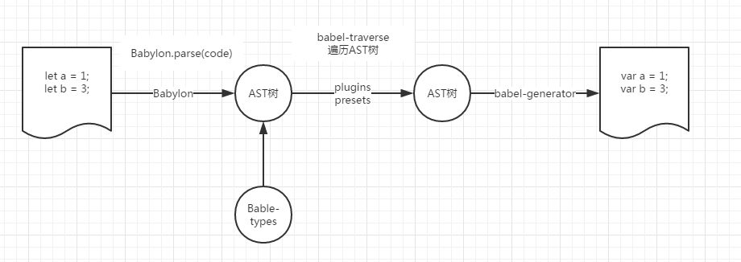
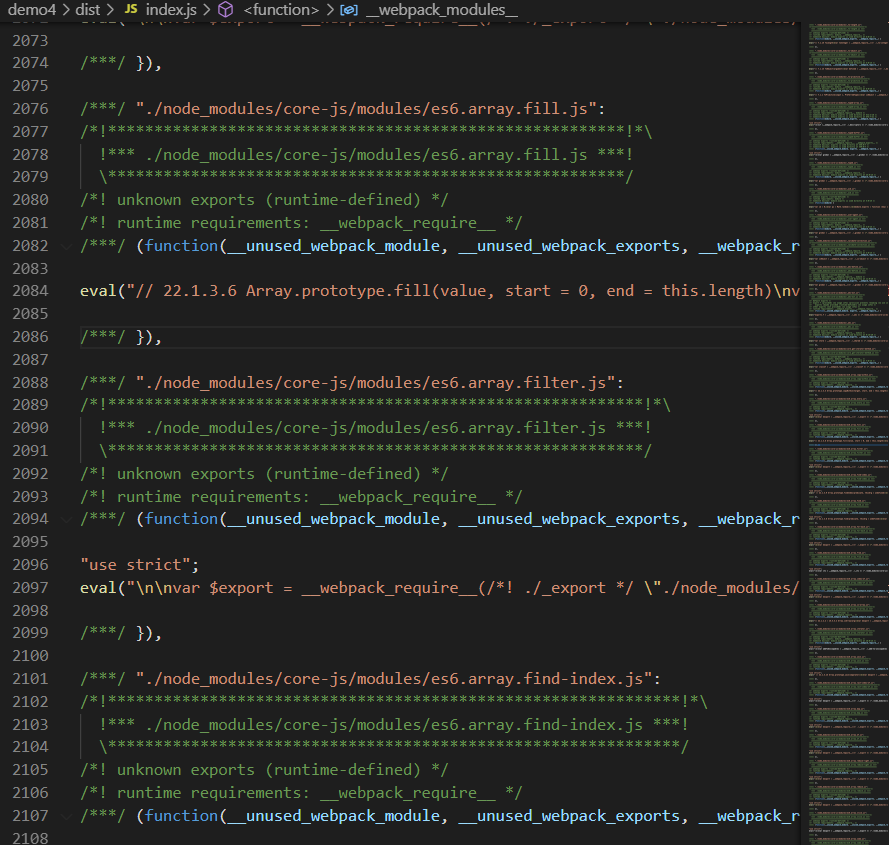

# babel 是什么
Babel 是一个工具链，主要用于将 ECMAScript 2015+ 版本的代码转换为向后兼容的 JavaScript 语法，
以便能够运行在当前和旧版本的浏览器或其他环境中。下面列出的是 Babel 能为你做的事情：

- 语法层： let、const、class、箭头函数等，这些需要在构建时进行转译，是指在语法层面上的转译，
  (比如class...将来会被转译成var function...)
  
- api层：Promise、includes、map等，这些是在全局或者Object、Array等的原型上新增的方法，
  通过 Polyfill 方式在目标环境中添加缺失的特性（转API）


# babel 工作原理


babel 的编译过程分为三个阶段：**parsing**、**transforming**、**generating**，以 ES6 编译为 ES5 作为例子：

1.  ES6 代码输入；
2.  babylon 进行解析得到 AST；
3.  babel-traverse 对 AST树进行遍历编译，得到新的 AST树；
4.  babel-generator 通过 AST树生成 ES5 代码。

## @babel/core
babylon,babel-traverse,babel-generator 都是定义在@babel/core中
@babel/core本身不具备转换处理的功能，它会调用配置文件中的 plugins 和 presets去转换代码；
因此当我们不添加任何插件的时候，输入输出代码是相同的。

## @babel/cli
@babel/cli是Babel自带了一个内置的CLI命令行工具，我们就可以通过命令行来编译文件；

# 配置文件
我们虽然可以在命令行中配置各种插件（plugins）或者预设（presets，也就是一组插件），但是这样并不利于后期的查看或者维护，
而且大多时候babel都是结合webpack或者gulp等打包工具开发，不会直接通过命令行的方式；因此Babel推荐通过配置文件的方式来进行管理。
Babel的配置文件主要有.babelrc、.babelrc.js、babel.config.js和package.json，他们的配置选项都是相同的，作用也是一样，
主要区别在于格式语法的不同，因此我们在项目中只需要选择其中一种即可。
## .babelrc
它的配置主要是JSON格式的
```
{
  "presets": [...],
  "plugins": [...]
}
```
## .babelrc.js 和 babel.config.js
都是JS语法，通过module.exports输出配置：
```
module.exports = function (api) {
  api.cache(true);
  const presets = [ ... ];
  const plugins = [ ... ];
  if (process.env["ENV"] === "prod") {
    plugins.push(...);
  }
  return {
    presets,
    plugins
  };
}
```
## package.json
```
{
  "name": "demo",
  "version": "1.0.0",
  "babel": {
    "presets": [ ... ],
    "plugins": [ ... ],
  }
}
```

## 执行顺序

*   plugins 的执行在 presets 之前
*   plugins 会按照声明的插件列表顺序顺序执行（first to last）
*   presets 会按照声明的列表顺序倒序执行（last to first）

# @babel/preset-env
>@babel/preset-env是一个智能预设，会根据目标浏览器来智能转换语法和 API（前提是安装了 @babel/polyfill（已废弃）或者 core-js与regenerator-runtime两个包）。
>**Note** @babel/preset-env does not support stage-x plugins.

## 设置支持的目标浏览器
默认情况下，如果不指定浏览器，preset-env 会转换所有 ES2015-ES2020 code to be ES5 compatible.
```
{
  "presets": ["@babel/preset-env"]
}
```

也可以通过targets属性或者 .browserslistrc指定目标浏览器
>By default @babel/preset-env will use browserslist config sources unless either the targets or ignoreBrowserslistConfig options are set.

1. targets
```json
{
  "presets": [
    [
      "@babel/preset-env",
      {
        "targets": "> 0.25%, not dead"
      }
    ]
  ]
}
```

2. .browserslistrc

```json
{
  "presets": [
    [
      "@babel/preset-env"
    ]
  ]
}
```
.browserslistrc
```
> 0.25%
not dead
```
或者在package.json
```json
{
  "private": true,
  "dependencies": {
    "autoprefixer": "^6.5.4"
  },
  "browserslist": [
    "last 1 version",
    "> 1%",
    "IE 10"
  ]
}
```

比如我们在项目中使用了箭头函数、Class、Const和模板字符串：

```js
let fun = () => console.log("hello babel.js");
class Person {
  constructor(name) {
    this.name = name;
  }
  say() {
    console.log(`my name is：${this.name}`);
  }
}
const tom = new Person("tom");
tom.say();
```

如果不指定浏览器，通过Babel编译后输出：
```js
function _classCallCheck(instance, Constructor) { if (!(instance instanceof Constructor)) { throw new TypeError("Cannot call a class as a function"); } }

function _defineProperties(target, props) { for (var i = 0; i < props.length; i++) { var descriptor = props[i]; descriptor.enumerable = descriptor.enumerable || false; descriptor.configurable = true; if ("value" in descriptor) descriptor.writable = true; Object.defineProperty(target, descriptor.key, descriptor); } }

function _createClass(Constructor, protoProps, staticProps) { if (protoProps) _defineProperties(Constructor.prototype, protoProps); if (staticProps) _defineProperties(Constructor, staticProps); return Constructor; }

var fun = function fun() {
  return console.log('hello babel.js');
};

var Person = /*#__PURE__*/function () {
  function Person(name) {
    _classCallCheck(this, Person);

    this.name = name;
  }

  _createClass(Person, [{
    key: "say",
    value: function say() {
      console.log("my name is\uFF1A".concat(this.name));
    }
  }]);

  return Person;
}();

var tom = new Person('tom');
tom.say();
```
如如指定浏览器为最新的2个版本Chrome浏览器
```json
{
  "presets": [
    [
      "@babel/env",
      {
        "targets": "last 2 Chrome versions"
      }
    ]
  ]
}
```
Babel再次编译输出：因为新版本的Chrome已经支持箭头函数、Class、Const和模板字符串，所以在编译时不会在进行转换
```js
"use strict";

let fun = () => console.log("hello babel.js");

class Person {
  constructor(name) {
    this.name = name;
  }

  say() {
    console.log(`my name is：${this.name}`);
  }

}

const tom = new Person("tom");
tom.say();
```

## 设置按需引入的 polyfill 
>需要安装 @babel/polyfill（已废弃）或者 core-js与regenerator-runtime两个包）。

虽然@babel/preset-env可以转换大多高版本的JS语法，但是一些ES6原型链上的函数（比如数组实例上的的filter、fill、find等函数）以及新增的内置对象（比如Promise、Proxy等对象），
是低版本浏览器本身内核就不支持，因此@babel/preset-env面对他们时也无能为力。
比如我们常用的filter函数，在IE浏览器上就会出现兼容性问题，因此我们通过polyfill（垫片）的方式来解决，下面是filter函数简单的兼容代码： 。
```js
if (!Array.prototype.filter) {
  Array.prototype.filter = function (fun /*, thisp*/ ) {
    var len = this.length;
    if (typeof fun != "function") {
      throw new TypeError();
    }
    var res = new Array();
    var thisp = arguments[1];
    for (var i = 0; i < len; i++) {
      if (i in this) {
        var val = this[i];
        if (fun.call(thisp, val, i, this)) {
          res.push(val);
        }
      }
    }
    return res;
  };
}
```
但是ES有那么多函数和内置对象，我们不可能一个一个都手写来解决，这就到了@babel/polyfill用武之处了；首先我们需要在项目中安装它：
```
npm install --save @babel/polyfill
```
安装完成后在需要转换的文件入口加入引用代码：
```
import '@babel/polyfill'
```
或者我们也可以在Webpack入口处进行引入：
```js
module.exports = {
  entry: ["@babel/polyfill", "./src/index.js"],
};
```
然后通过webpack来打包，这样就能看到在我们的代码中加入了很多的兼容代码，如下图


发现我们数组的fill、filter和findIndex等方法都打包进去了，但是有以下两个问题：

1. 不是按需引入的，是把所有的polyfill都打进来了。
2. 污染全局变量；polyfill给很多类的原型链上添加函数，如果我们开发的是一个类库给其他开发者使用，这种情况会非常不可控。

因此从Babel7.4开始@babel/polyfill就不推荐使用了，而是直接引入core-js与regenerator-runtime两个包；
而@babel/polyfill本身也是这两个包的集合；在上面webpack打包出来的dist文件我们也可以看到，引用的也是这两个包。那core-js到底是什么呢？

- 它是JavaScript标准库的polyfill
- 它尽可能的进行模块化，让你能选择你需要的功能
- 它和babel高度集成，可以对core-js的引入进行最大程度的优化
目前我们使用的默认都是core-js@2，但它已经封锁了分支，在此之后的特性都只会添加到core-js@3，因此也是推荐使用最新的core-js@3。

**因此我们使用 useBuiltIns来设置按需引入。 使用corejs设置core-js版本；**
```json
{
  "presets": [
    [
      "@babel/preset-env",
      {
        "useBuiltIns": "usage",
        "corejs": 3
      }
    ]
  ]
}
```

编译
```js
Object.assign({}, {});

[(1, 5, 10, 15)].filter(function (value) {
  return value > 9;
});

let promise = new Promise((resolve, reject) => {
  resolve(1);
});
```

结果为
```js
"use strict";

require("core-js/modules/es.array.filter");

require("core-js/modules/es.object.assign");

require("core-js/modules/es.object.to-string");

require("core-js/modules/es.promise");

Object.assign({}, {});
[(1, 5, 10, 15)].filter(function (value) {
  return value > 9;
});
var promise = new Promise(function (resolve, reject) {
  resolve(1);
});

```
由于没有指定目标浏览器，所以会引入polyfill，但也只是代码中用到的。也就是按需引入。

## 如何解决 @babel/preset-env转换语法时加入的辅助函数。

>使用 @babel/plugin-transform-runtime 引入 @babel/runtime中的辅助函数

@babel/plugin-transform-runtime:

有两个作用：
1. 引用@babel/runtime中的辅助函数。
2. 引用@babel/runtime-corejs3中的API实现，防止污染全局变量。

@babel/runtime:
>is a library that contains Babel modular runtime helpers and a version of regenerator-runtime.
> 就是包含那些辅助函数的包

我们在上面通过@babel/preset-env转换Class类时发现输出文件的头部多了_classCallCheck、_defineProperties和_createClass三个函数声明，这就是注入的函数，称为辅助函数；
@babel/preset-env在转换时注入了函数声明，以便语法转换后使用。
如果每个文件都注入了函数声明，再通过打包工具打包后输出文件又会非常庞大，影响性能。
因此，Babel提供的解决思路是把这些辅助函数都放到一个npm包里面，在每次需要使用的时候就从这个包里把函数require出来；这样即使有几千个文件，也都是对函数进行引用，而不是复制代码；
@babel/runtime就是这些辅助函数的集合包.

例如
```js
class Person {}
```
被编译为
```js
"use strict";

function _classCallCheck(instance, Constructor) {
  if (!(instance instanceof Constructor)) {
    throw new TypeError("Cannot call a class as a function");
  }
}

var Person = function Person() {
  _classCallCheck(this, Person);
};
```

配置为
```
{
  presets: ['@babel/preset-env'],
  plugin: [
    [
      '@babel/plugin-transform-runtime',
      {
        corejs: 3,
      },
    ],
  ]
}
```
编译结果为
```js
"use strict";

var _classCallCheck2 = require("@babel/runtime/helpers/classCallCheck");

var _classCallCheck3 = _interopRequireDefault(_classCallCheck2);

function _interopRequireDefault(obj) {
  return obj && obj.__esModule ? obj : { default: obj };
}

var Person = function Person() {
  (0, _classCallCheck3.default)(this, Person);
};
```


## 如何解决 @babel/preset-env 引入 @babel/polyfill(已废弃) 或者 core-js和regenerator-runtime 导致的污染全局变量

>使用 @babel/plugin-transform-runtime 引入 @babel/runtime-corejs3中的API实现。

配置还是为
```
{
  presets: ['@babel/preset-env'],
  plugin: [
    [
      '@babel/plugin-transform-runtime',
      {
        corejs: 3,
      },
    ],
  ]
}
```
编译结果为
```js
"use strict";

var _interopRequireDefault = require("@babel/runtime-corejs3/helpers/interopRequireDefault");

var _promise = _interopRequireDefault(require("@babel/runtime-corejs3/core-js-stable/promise"));

var _filter = _interopRequireDefault(require("@babel/runtime-corejs3/core-js-stable/instance/filter"));

var _context;

(0, _filter["default"])(_context = [1, 5, 10, 15]).call(_context, function (value) {
  return value > 9;
});
var promise = new _promise["default"](function (resolve, reject) {
  resolve(1);
});
```

# babel配置最佳实践

**note:** 根据需要指定目标浏览器。配置targets 或者 .browserslistrc
```js
rules: [
  {
    test: /\.js$/,
    exclude: /(node_modules|bower_components)/,
    use: {
        loader: 'babel-loader',
        options: {
            presets: ['@babel/preset-env'],
            plugin: [
                [
                    '@babel/plugin-transform-runtime',
                    {
                        corejs: 3,
                    },
                ],
            ],
        },
    },
  },
];
```

