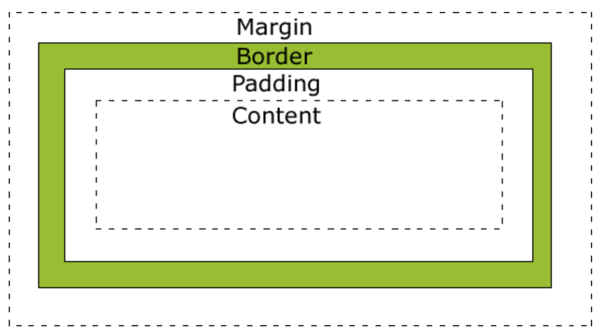
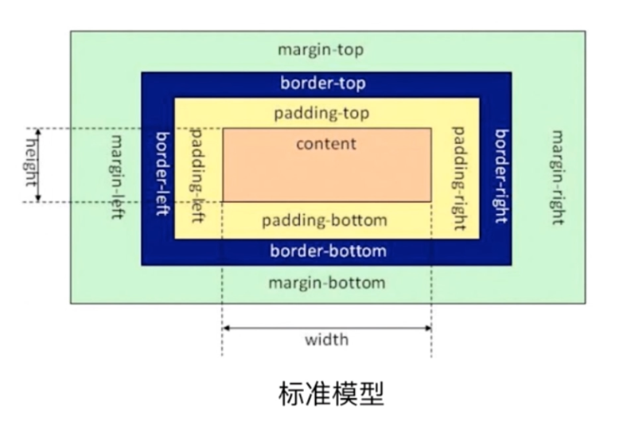
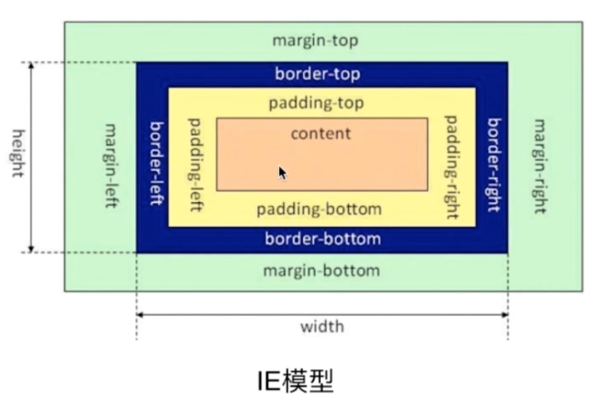

# CSS 盒模型

## 基本概念

所有 HTML 元素都可以视为一个盒子，该盒子包括：边距(margin)、边框(border)、填充(padding)和实际内容(content)




## 标准模型（W3C模型）和 IE 模型

差异：宽高计算方式不同

标准模型：width/height 设置的是 content 的宽高



IE模型：width/height 设置的是  content + padding + border 的宽高




## 如何设置两种模型

```css
div {
  // 设置标准模型
  box-sizing: content-box;
  // 设置IE模型
  box-sizing: border-box;
}
```

box-sizing 的默认值是 content-box


## JS 如何设置盒模型的宽高

假设已经获取节点 dom

```javascript
// 只能获取内联样式设置的宽高
dom.style.width/height

// 获取渲染后即使运行的宽高，只支持IE
dom.currentStyle.width/height

// 获取渲染后即时运行的宽高，兼容性很好
dom.getComputedStyle.width/height

// 获取渲染后即使运行的宽高，兼容性很好，一般用来获取元素的绝对位置
dom.getBoundingClientRect().width/height
```
