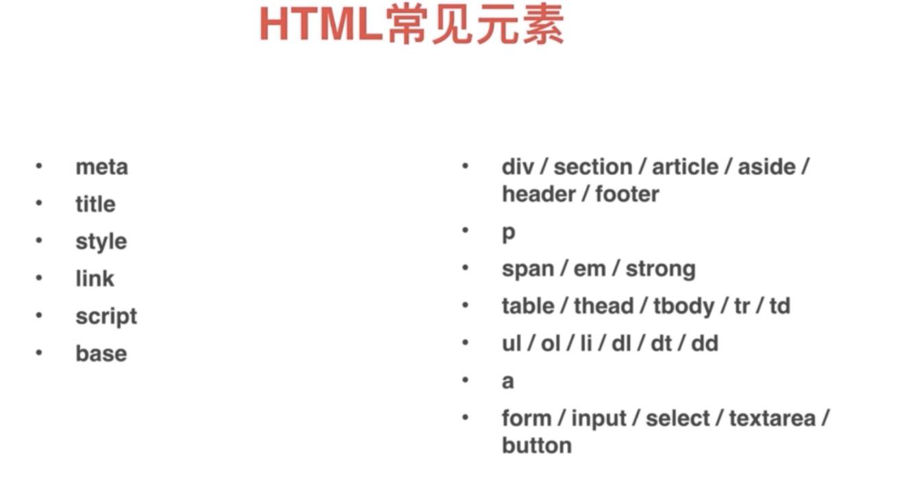
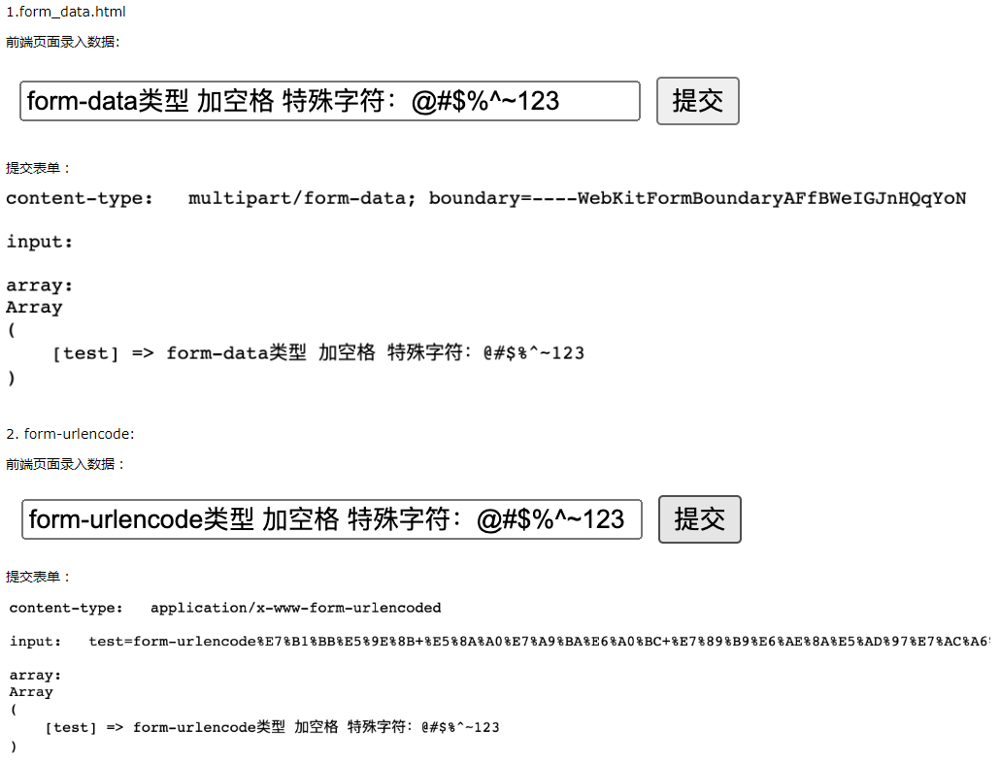
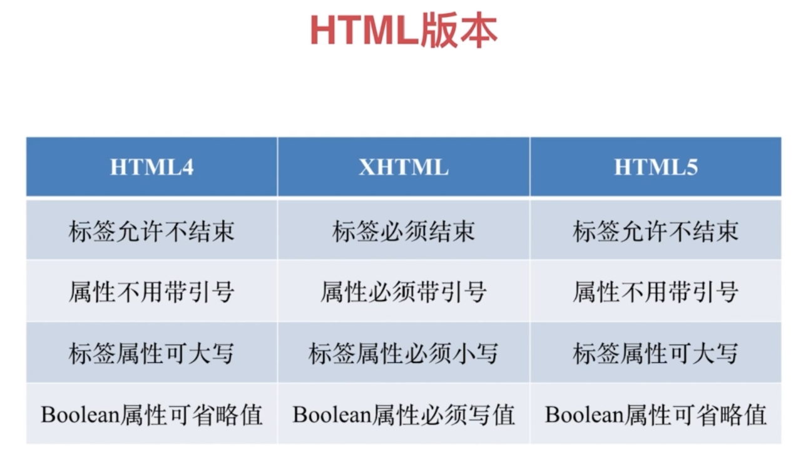
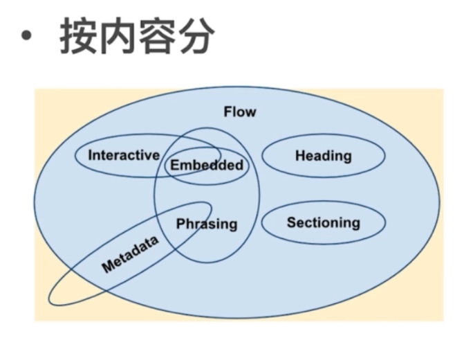

# HTML 常见元素


左侧为 `<head>/<head>`里面的，右侧为`<body></body>`里面的.

## base
`<base href="api/">`: 指定a连接的根路径 为 "api"

## 适配移动端时，要指定viewport的宽度为设备的宽度。
`<meta name="viewport" content="width=device-width, initial-scale=1.0">`

## `<form enctype="value">`
enctype 属性规定在发送到服务器之前应该如何对表单数据进行编码。

默认地，表单数据会编码为 "application/x-www-form-urlencoded"。
就是说，在发送到服务器之前，所有字符都会进行编码（空格转换为 "+" 加号，特殊符号转换为 ASCII HEX 值）。

|值|描述|
|---|---|
| application/x-www-form-urlencoded | 在发送前编码所有字符（默认）|
| multipart/form-data | 不对字符编码。在使用包含文件上传控件的表单时，必须使用该值。|
| text/plain | 空格转换为 "+" 加号，但不对特殊字符编码 |


express-bodyParser和koa-bodyparser可以用来解析form表单提交过来的数据。
https://www.jianshu.com/p/93eb2bc8d97e

## 有了ajax还需要`<form>`的提交吗？
需要，因为
1. Reset可以清空表单内容
2. 可以获取表单的内容
3. 表单的验证
4. 浏览器可以记住用户的输入

## Label的for属性：点击for指定的文字也可以选中。
## Button type属性为submit和reset时只在`<form>`里面才有意义。

## HTML 版本


## HTML 元素分类
1. 按默认样式分
- 块级 block
- 行内 inline
- inline-block
  
Block: 占据一行，可以设置宽高

Inline：不占据一行，设置宽高不起作用

Inline-block：对外表现的是inline，对内是block的，可以设置宽高

2. 按内容分
   
  

## HTML 元素嵌套关系
- 块级元素可以包含行内元素
- 块级元素不一定能包含块级元素
  `<p>中不能嵌套<div>`
- 行内元素一般不能包含块级元素 

## HTML元素默认样式
使用以下来重置浏览器默认样式。
```
* {
  margin:0;
  padding:0;
}
```

## doctype的意义是什么？

## property 与 attribute 区别
- attribute是“死”的
- property是“活”的
`<input type=”text” value=”3”>`
写在html中的value是attribute。
浏览器解析HTML成DOM后，value是DOM的property

通过$0.setAttribute(‘value’,4) 或者$0.value = ‘5’ 更改attribute 或property互不影响。