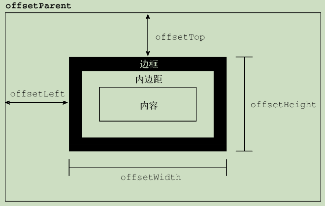
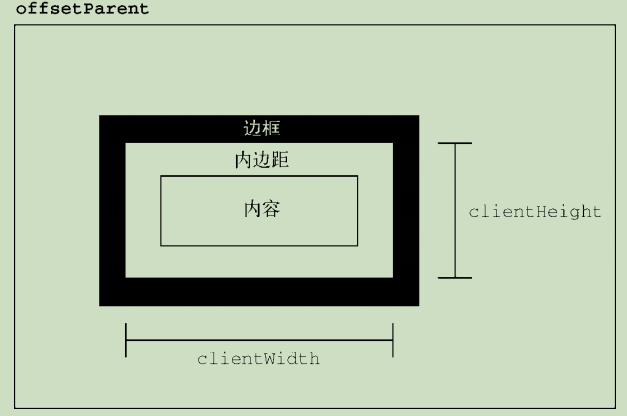
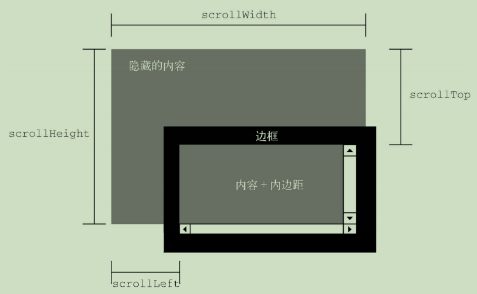
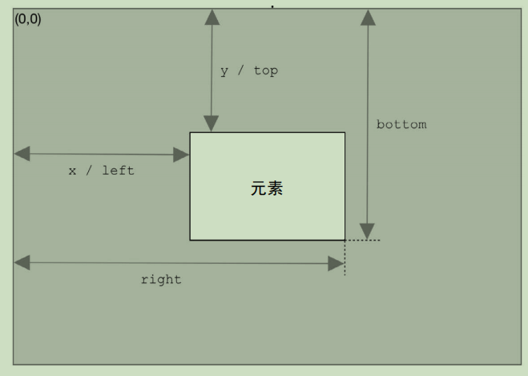

DOM2 和 DOM3 Core 模块的目标是扩展 DOM API，满足 XML 的所有需求并提供更好的错误处理和特性检测。

# 获取、设置样式

## style 属性
1. 可以通过 style 属性 获取、设置元素的样式信息，但不包含通过层叠机制从文档样式和外部样式中继承来的样式。
2. 因为 CSS 属性名使用连字符表示法（用连字符分隔两个单词，如 background-image），
所以在 JavaScript 中这些属性必须转换为驼峰大小写形式（如backgroundImage）

```js
let myDiv = document.getElementById("myDiv"); 
// 设置背景颜色
myDiv.style.backgroundColor = "red"; 
// 修改大小
myDiv.style.width = "100px"; 
myDiv.style.height = "200px"; 
// 设置边框
myDiv.style.border = "1px solid black";
```

## getComputedStyle()
为了解决style属性只能获得通过style设置的样式。
1. getComputedStyle()可以获得计算后的样式。
2. 不能修改 getComputedStyle()方法返回的对象，只读的。
```
<!DOCTYPE html> 
<html> 
<head> 
 <title>Computed Styles Example</title> 
 <style type="text/css"> 
 #myDiv { 
 background-color: blue; 
 width: 100px; 
 height: 200px; 
 } 
 </style> 
</head> 
<body> 
 <div id="myDiv" style="background-color: red; border: 1px solid black"></div> 
</body> 
</html>
```
```js
let myDiv = document.getElementById("myDiv"); 
let computedStyle = document.defaultView.getComputedStyle(myDiv, null); 
console.log(computedStyle.backgroundColor); // "red" 
console.log(computedStyle.width); // "100px" 
console.log(computedStyle.height); // "200px" 
console.log(computedStyle.border); // "1px solid black"（在某些浏览器中）
```

# 元素尺寸

## 偏移尺寸

- offsetHeight，元素在垂直方向上占用的像素尺寸，包括它的高度、水平滚动条高度（如果可
见）和上、下边框的高度。
- offsetLeft，元素左边框外侧距离包含元素左边框内侧的像素数。
- offsetTop，元素上边框外侧距离包含元素上边框内侧的像素数。
- offsetWidth，元素在水平方向上占用的像素尺寸，包括它的宽度、垂直滚动条宽度（如果可
见）和左、右边框的宽度。
- 其中，offsetLeft 和 offsetTop 是相对于包含元素的，包

## 客户端尺寸

元素的客户端尺寸（client dimensions）包含元素内容及其内边距所占用的空间。客户端尺寸只有两
个相关属性：clientWidth 和 clientHeight。其中，clientWidth 是内容区宽度加左、右内边距宽
度，clientHeight 是内容区高度加上、下内边距高度

客户端尺寸实际上就是元素内部的空间，因此不包含滚动条占用的空间。这两个属性最常用于确定
浏览器视口尺寸，即检测 document.documentElement 的 clientWidth 和 clientHeight。这两个
属性表示视口（\<html>或\<body>元素）的尺寸。

## 滚动尺寸

- scrollHeight，没有滚动条出现时，元素内容的总高度。
- scrollLeft，内容区左侧隐藏的像素数，设置这个属性可以改变元素的滚动位置。
- scrollTop，内容区顶部隐藏的像素数，设置这个属性可以改变元素的滚动位置。
- scrollWidth，没有滚动条出现时，元素内容的总宽度。

## 确定元素尺寸

浏览器在每个元素上都暴露了 getBoundingClientRect()方法，返回一个 DOMRect 对象，包含
6 个属性：left、top、right、bottom、height 和 width。
