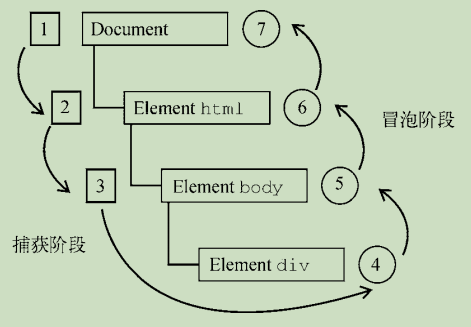

# DOM 事件

## 事件级别

1.  DOM 0级

    ```javascript
    el.onclick = function() {
    }
    ```

    >1. 同一个元素/标签绑定多个同类型的事件时（如给同一个按钮绑定三个点击事件），是不被允许的。
    >2. 给元素的事件行为绑定方法，这些方法都是在冒泡阶段执行的。

2.  DOM 2级

    使用 DOM2 方式的主要优势是可以为同一个事件添加多个事件处理程序。

    ```js
    let btn = document.getElementById("myBtn"); 
    btn.addEventListener("click", () => { 
     console.log(this.id); 
    }, false); 
    btn.addEventListener("click", () => { 
     console.log("Hello world!"); 
    }, false);
    ```
    
    ```js
    el.addEventListener(eventName, callback, useCapture)
    el.removeEventListener(eventName, callback, useCapture)
    
    // eventName: 事件名称，可以是标准的 DOM 事件
    // callback: 回调函数，当事件触发时，函数会被注入一个参数为当前的事件对象 event
    // useCapture: 默认为false，代表事件句柄在冒泡阶段执行
    // true 表示在捕获阶段调用事件处理程序
    ```
    ```js
    // 删除时要使用同一个 handler
    let btn = document.getElementById("myBtn"); 
    let handler = function() { 
     console.log(this.id); 
    }; 
    // add
    btn.addEventListener("click", handler, false); 
    // remove
    btn.removeEventListener("click", handler, false); // 有效果！
    ```

3.  DOM 3级，写法和 DOM 2级一致，只是在 DOM 2级事件的基础上添加了更多的事件类型

    >   UI 事件：当前用户与页面的元素交互时触发：load，scroll
    >
    >   焦点事件：当元素获得或失去焦点时触发：blur，focus
    >
    >   鼠标事件：当用户通过鼠标在页面执行操作时触发：dblclick，mouseup
    >
    >   滚轮事件：当使用鼠标滚轮或类似设备时触发：mousewheel
    >
    >   文本事件：当在文档中输入文本时触发：textinput
    >
    >   键盘事件：当用户通过键盘在页面上执行操作时触发：keydown，keypress
    >
    >   合成事件：当为 IME（输入法编辑器）输入字符时触发：compositionstart
    >
    >   变动事件：当底层 DOM 结构发生变化时触发：DOMsubtreeModified
    >
    >   同时 DOM 3级事件也允许使用者自定义一些事件
    >   
    >   H5定义的事件


## DOM 事件模型 事件流

事件模型分为：**捕获**和**冒泡**

事件流：

1.  捕获阶段：事件从 window 对象自上而下向目标节点传播的阶段
2.  目标阶段：真正的目标节点正在处理事件的阶段
3.  冒泡阶段：事件从目标节点自下而上向 window 对象传播的阶段





## Event 对象使用
>在 DOM 中发生事件时，所有相关信息都会被收集并存储在一个名为 event 的对象中。这个对象包
含了一些基本信息，比如导致事件的元素、发生的事件类型，以及可能与特定事件相关的任何其他数据。
例如，鼠标操作导致的事件会生成鼠标位置信息，而键盘操作导致的事件会生成与被按下的键有关的信
息。所有浏览器都支持这个 event 对象，尽管支持方式不同

1. 获取event对象：
```js
let btn = document.getElementById("myBtn"); 
btn.onclick = function(event) { 
 console.log(event.type); // "click" 
}; 
btn.addEventListener("click", (event) => { 
 console.log(event.type); // "click" 
}, false);
```
```
<input type="button" value="Click Me" onclick="console.log(event.type)">
```

2. 公共属性

|属性/方法| 类 型| 读/写| 说 明|
|-------|------|-----|----|
|bubbles |布尔值| 只读| 表示事件是否冒泡|
|cancelable| 布尔值| 只读| 表示是否可以取消事件的默认行为|
|currentTarget| 元素| 只读| 当前事件处理程序所在的元素|
|defaultPrevented| 布尔值| 只读| true 表示已经调用 preventDefault()方法（DOM3 Events 中新增）|
|detail| 整数| 只读| 事件相关的其他信息|
|eventPhase| 整数| 只读 |表示调用事件处理程序的阶段：1 代表捕获阶段，2 代表到达目标，3 代表冒泡阶段|
|preventDefault()| 函数| 只读| 用于取消事件的默认行为。只有 cancelable 为 true 才可以调用这个方法|
|stopImmediatePropagation()| 函数| 只读| 用于取消所有后续事件捕获或事件冒泡，并阻止调用任何后续事件处理程序（DOM3 Events 中新增）|
|stopPropagation()| 函数| 只读| 用于取消所有后续事件捕获或事件冒泡。只有 bubbles为 true 才可以调用这个方法
|target| 元素| 只读 |事件目标||
|trusted |布尔值 |只读| true 表示事件是由浏览器生成的。false 表示事件是开发者通过 JavaScript 创建的（DOM3 Events 中新增）|
|type |字符串| 只读| 被触发的事件类型|
|View |AbstractView |只读 |与事件相关的抽象视图。等于事件所发生的 window 对象|


3.  阻止默认行为：`event.preventDefault()`

    链接的默认行为就是在被单击时导航到 href 属性指定的 URL。如果想阻止这个导航行为，可以在 onclick 事件处理程序中取消。
    ```js
    let link = document.getElementById("myLink"); 
    link.onclick = function(event) { 
     event.preventDefault(); 
    };
    ```

4.  阻止冒泡：

    1.  `event.stopPropagation()` 阻止事件冒泡到父元素，阻止任何父事件处理程序被执行
    2.  `event.stopImmediatePropagation()` 既能阻止事件向父元素冒泡，也能阻止元素同事件类型的其他监听器被触发

5.  `event.target & event.currentTarget`

    ```html
    <div id="a">
      aaaa
      <div id="b">
        bbbb
        <div id="c">
          cccc
          <div id="d">
            dddd
          </div>
        </div>
      </div>
    </div>
    
    <script>
    	document.getElementById("a").addEventListener("click", function(e) {
        console.log(
        	"target:" e.target.id + "& currentTarget:" + e.currentTarget.id
        )
      })
      document.getElementById("b").addEventListener("click", function(e) {
        console.log(
        	"target:" e.target.id + "& currentTarget:" + e.currentTarget.id
        )
      })
      document.getElementById("c").addEventListener("click", function(e) {
        console.log(
        	"target:" e.target.id + "& currentTarget:" + e.currentTarget.id
        )
      })
      document.getElementById("d").addEventListener("click", function(e) {
        console.log(
        	"target:" e.target.id + "& currentTarget:" + e.currentTarget.id
        )
      })
    </script>
    
    <!-- 
    	当我们点击最里层的元素 d 时，会依次输出：
    	target: d & currentTarget: d
    	target: d & currentTarget: c
    	target: d & currentTarget: b
    	target: d & currentTarget: a
    -->
    ```

    由上述例子可知：`event.currentTarget` 始终是监听事件者，而 `event.target` 是事件的真正发出者
    currentTarget 是注册事件处理程序的元素。而 target 属性才是 click 事件真正的目标。

6. 在事件处理程序内部，this 对象始终等于 currentTarget 的值
    而当 eventPhase 等于 2 时，this、target 和 currentTarget 三者相等。

## 事件委托（代理）

由于事件会在冒泡阶段向上传播到父节点，因此可以把子节点的监听函数定义在父节点上，
由父节点的监听函数统一处理多个子元素的事件，这种方法叫事件的代理。

优点：

*   减少内存消耗，不需要为每个子元素绑定事件，提高性能
*   动态绑定事件


## 自定义事件

```javascript
// 创建事件，Event 是无法传递参数的
var event = new Event('event')

// 创建参数，CustomEvent 允许传递参数
var event = new CustomEvent('event', { detail: 'Hello world' })

// 监听事件
el.addEventListener('event', function(e) {
  // ...
}, false)

// 分发事件
el.dispatchEvent(event)
```


## 手写发布订阅模式

```typescript
class EventEmitter {
  events: {[key: string]: Function[]} = {}
  
 	// 订阅
	on(type: string, callback: Function) {
    if(!this.events) this.events = Object.create(null)
    
    if(!this.events[type]) {
      this.events[type] = [callback]
    }else {
      this.events[type].push(callback)
    }
  }
  
  // 取消订阅
  off(type: string) {
    if(!this.events[type]) return 
   	delete this.events[type]
  }
  
  // 只执行一次订阅
  once(type: string, callback: Function) {
    function fn() {
      callback()
      this.off(type)
    }
    
    this.on(type, fn)
  }
  
  // 触发事件
  emit(type: string, ...rest) {
    this.events[type] && this.events[type].forEach(fn => fn(...rest))
  }
}

// 使用情况
const event = new EventEmitter()

event.on('click', (...rest) => {
  console.log(rest)
})

event.emit('click')

event.off('click')

event.once('click', (...rest) => {
  console.log(rest)
})
```

## DOMContentLoaded 事件
window 的 load 事件会在页面完全加载后触发，因为要等待很多外部资源加载完成，所以会花费
较长时间。而 DOMContentLoaded 事件会在 DOM 树构建完成后立即触发，而不用等待图片、JavaScript
文件、CSS 文件或其他资源加载完成。相对于 load 事件，DOMContentLoaded 可以让开发者在外部资
源下载的同时就能指定事件处理程序，从而让用户能够更快地与页面交互。

