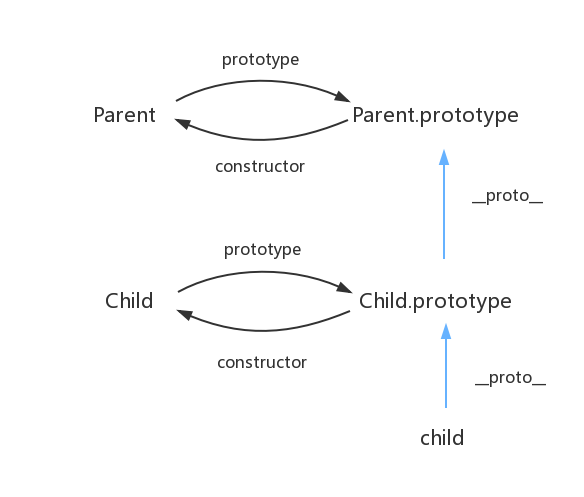
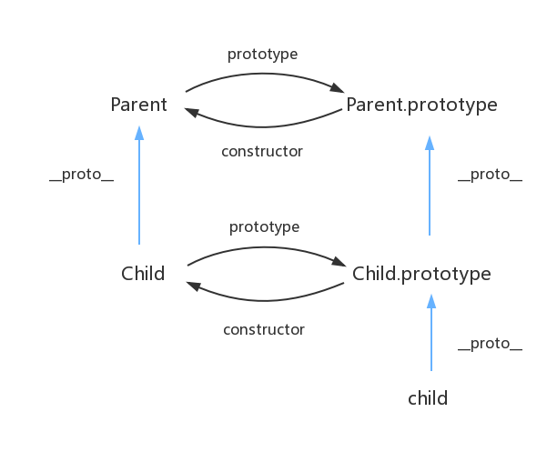

# ES5继承与Class继承的区别

## ES5中最优的继承方式： 寄生组合式继承
```js
function Parent (name) {
    this.name = name;
}

Parent.prototype.getName = function () {
    console.log(this.name)
}

function Child (name, age) {
    Parent.call(this, name);
    this.age = age;
}

Child.prototype = Object.create(Parent.prototype);

var child1 = new Child('kevin', '18');

console.log(child1);
```

## ES6 Class继承

Class 通过 extends 关键字实现继承，这比 ES5 的通过修改原型链实现继承，要清晰和方便很多。

以上 ES5 的代码对应到 ES6 就是：
```js
class Parent {
    constructor(name) {
        this.name = name;
    }
}

class Child extends Parent {
    constructor(name, age) {
        super(name); // 调用父类的 constructor(name)
        this.age = age;
    }
}

var child1 = new Child('kevin', '18');

console.log(child1);
```
ES6 的原型链示意图为：


## 区别
1. es5中子类构造函数与父类构造函数没有关系。
但是es6中子类构造函数继承父类构造函数，也就是子类可以继承父类的静态方法。

2. Parent.call(this) 与 Super关键字
Parent.call(this) 是先实例化子类对象，然后调用父类构造函数添加属性。
Super关键字是先实例化父类对象，然后返回给子类，调用子类构造函数添加属性。
所以要在调用Super() 后才能使用this


