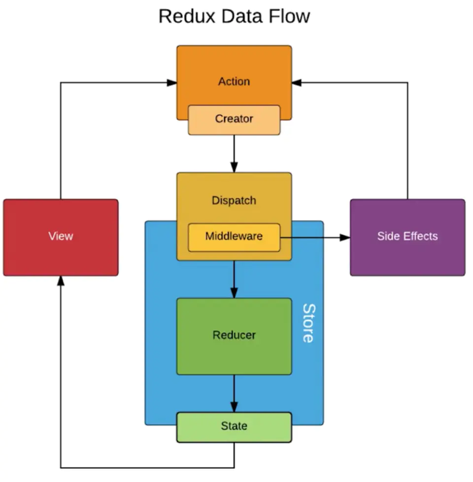

# Flux
FLux是一种架构是想，单向数据流。

要点：
## dispatcher：
分发action到所有store
## store
监听dispatch分发过来的action，根据action类型更新state。
一个应用可以有多个store。
## Views and Controller-Views
监听store中state的更新，更新view
## action
就是个对象
```
{
  type:'',
  payload:''
}
```

# Redux
Redux 是Flux的一种实现，但是Redux只有一个store。

流程图：



## store
创建store时，传入处理action的reducer，和初始state。
```
const store = createStore(reducer, initialState)
```

## reducer
reducer是一个纯函数，根据action，返回新的state。
不能直接修改state值。
```js
function reducer(state, action) {
  const { type, payload} = action;
  switch(type){
    case constants.ADD:
      return {...state, ...payload}
    default:
      return state;        
  }
}
```

## action

### 同步action
```js

function actionCreator(){
  return {
    type:'',
    payload:''
  };
}

```
### 异步action
需要使用 redux-thunk 中间件
```js
function actionCreator(){
  return (dispatch, getState)=>{
    const {url} = getState();
    axios.get(url).then((res)=>{
      dispatch({
        type:'',
        payload:''
      });
    });
  };
}

```


