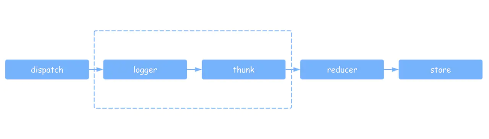
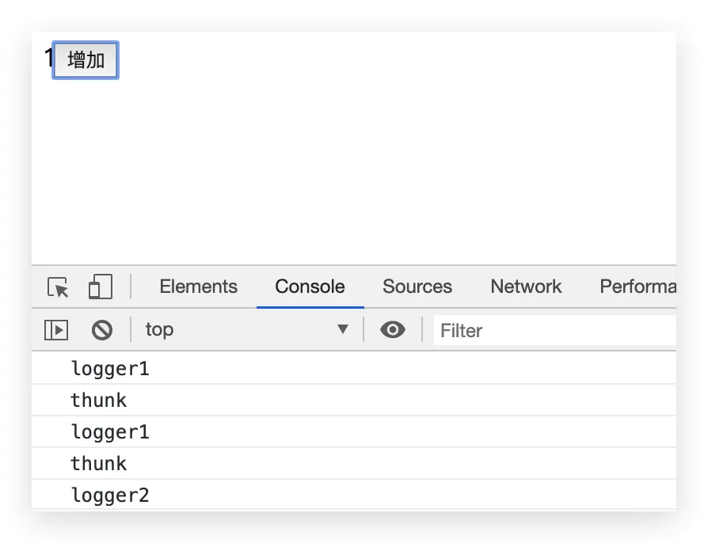
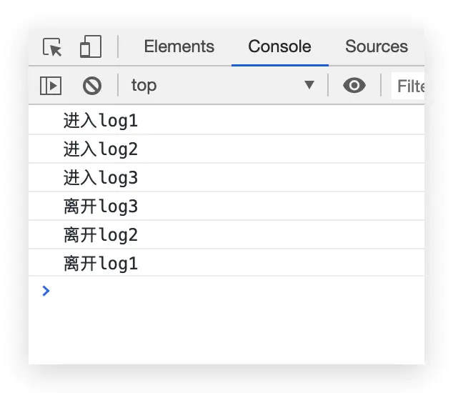
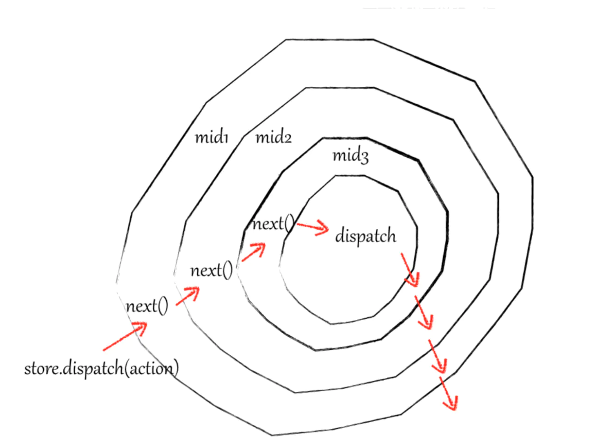

作者：写代码像蔡徐抻
链接：https://juejin.cn/post/6844904036013965325
来源：掘金
- redux的设计思路及实现原理
- react-redux的设计思路及实现原理
- redux中间件的设计思路及实现原理
# redux的设计思路及实现原理
在一切开始之前，我们首先要回答一个问题：为什么我们需要redux，redux为我们解决了什么问题？
只有回答了这个问题，我们才能把握redux的设计思路。

React作为一个组件化开发框架，组件之间存在大量通信， 有时这些通信跨越多个组件，或者多个组件之间共享一套数据，
简单的父子组件间传值不能满足我们的需求， 自然而然地，我们需要有一个地方存取和操作这些公共状态。
而redux就为我们提供了一种管理公共状态的方案，我们后续的设计实现也将围绕这个需求来展开。

我们思考一下如何管理公共状态：既然是公共状态，那么就直接把公共状态提取出来好了。
我们创建一个store.js文件，然后直接在里边存放公共的state，其他组件只要引入这个store就可以存取共用状态了。
```js
const state = {    
    count: 0
}
```
我们在store里存放一个公共状态count，组件在import了store后就可以操作这个count。
这是最直接的store，当然我们的store肯定不能这么设计，原因主要是两点：
1. 容易误操作
   
   比如说，有人一个不小心把store赋值了{}，清空了store，或者误修改了其他组件的数据，那显然不太安全，出错了也很难排查，
   因此我们需要有条件地操作store，防止使用者直接修改store的数据。
   
2. 可读性很差

   JS是一门极其依赖语义化的语言，试想如果在代码中不经注释直接修改了公用的state，
   以后其他人维护代码得多懵逼，为了搞清楚修改state的含义还得根据上下文推断，所以我们最好是给每个操作起个名字。

我们重新思考一下如何设计这个公共状态管理器，根据我们上面的分析，我们希望公共状态既能够被全局访问到，
又是私有的不能被直接修改，思考一下，闭包是不是就就正好符合这两条要求，因此我们会把公共状态设计成闭包.

既然我们要存取状态，那么肯定要有getter和setter，此外当状态发生改变时，我们得进行广播，通知组件状态发生了变更。
这不就和redux的三个API：**getState**、**dispatch**、**subscribe** 对应上了吗。我们用几句代码勾勒出store的大致形状：
```js
export const createStore = () => {    
    let currentState = {}       // 公共状态    
    function getState() {}      // getter    
    function dispatch() {}      // setter    
    function subscribe() {}     // 发布订阅    
    return { getState, dispatch, subscribe }
}
```
## getState实现
   
   getState()的实现非常简单，返回当前状态即可：
```js
export const createStore = () => {    
    let currentState = {}       // 公共状态    
    function getState() {       // getter        
        return currentState    
    }    
    function dispatch() {}      // setter    
    function subscribe() {}     // 发布订阅    
    return { getState, dispatch, subscribe }
}
```
## dispatch实现

但是dispatch()的实现我们得思考一下，经过上面的分析，我们的目标是有条件地、具名地修改store的数据，
那么我们要如何实现这两点呢？我们已经知道，在使用dispatch的时候，我们会给dispatch()传入一个action对象，
这个对象包括我们要修改的state以及这个操作的名字(actionType)，根据type的不同，store会修改对应的state。
我们这里也沿用这种设计：
```js
export const createStore = () => {    
    let currentState = {}    
    function getState() {        
        return currentState    
    }    
    function dispatch(action) {        
        switch (action.type) {            
            case 'plus':            
            currentState = {                 
                ...state,                 
                count: currentState.count + 1            
            }        
        }    
    }    
    function subscribe() {}    
    return { getState, subscribe, dispatch }
}
```
我们把对actionType的判断写在了dispatch中，这样显得很臃肿，也很笨拙，于是我们想到把这部分修改state的规则抽离出来放到外面，
这就是我们熟悉的reducer。我们修改一下代码，让reducer从外部传入：
```js
import { reducer } from './reducer'
export const createStore = (reducer) => {    
    let currentState = {}     
    function getState() {        
        return currentState    
    }    
    function dispatch(action) {         
        currentState = reducer(currentState, action)  
    }    
    function subscribe() {}    
    return { getState, dispatch, subscribe }
}
```
然后我们创建一个reducer.js文件，写我们的reducer
```js
//reducer.js
const initialState = {    
    count: 0
}
export function reducer(state = initialState, action) {    
    switch(action.type) {      
        case 'plus':        
            return {            
                ...state,                    
                count: state.count + 1        
            }      
        case 'subtract':        
            return {            
                ...state,            
                count: state.count - 1        
            }      
        default:        
            return initialState    
    }
}
```
代码写到这里，我们可以验证一下getState和dispatch：
```js
//store.js
import { reducer } from './reducer'
export const createStore = (reducer) => {    
    let currentState = {}        
    function getState() {                
        return currentState        
    }        
    function dispatch(action) {                
        currentState = reducer(currentState, action)  
    }        
    function subscribe() {}        
    return { getState, subscribe, dispatch }
}

const store = createStore(reducer)  //创建store
store.dispatch({ type: 'plus' })    //执行加法操作,给count加1
console.log(store.getState())       //获取state
```

运行代码，我们会发现，打印得到的state是：{count: NaN }，这是由于store里初始数据为空，state.count + 1实际上是underfind+1，
输出了NaN，所以我们得先进行store数据初始化，我们在执行dispatch({ type: 'plus' })之前先进行一次初始化的dispatch，
这个dispatch的actionType可以随便填，只要不和已有的type重复，让reducer里的switch能走到default去初始化store就行了：
```js
import { reducer } from './reducer'
export const createStore = (reducer) => {        
    let currentState = {}        
    function getState() {                
        return currentState        
    }        
    function dispatch(action) {                
        currentState = reducer(currentState, action)        
    }        
    function subscribe() {}    
    dispatch({ type: '@@REDUX_INIT' })  //初始化store数据        
    return { getState, subscribe, dispatch }
}

const store = createStore(reducer)      //创建store
store.dispatch({ type: 'plus' })        //执行加法操作,给count加1
console.log(store.getState())           //获取state
```
## subscribe实现
尽管我们已经能够存取公用state，但store的变化并不会直接引起视图的更新，我们需要监听store的变化，
这里我们应用一个设计模式——观察者模式，观察者模式被广泛运用于监听事件实现（有些地方写的是发布订阅模式，
但我个人认为这里称为观察者模式更准确，有关观察者和发布订阅的区别，讨论有很多，读者可以搜一下）

所谓观察者模式，概念也很简单：观察者监听被观察者的变化，被观察者发生改变时，通知所有的观察者。那么我们如何实现这种监听-通知的功能呢，
为了照顾还不熟悉观察者模式实现的同学，我们先跳出redux，写一段简单的观察者模式实现代码：
```js
//观察者
class Observer {    
    constructor (fn) {      
        this.update = fn    
    }
}
//被观察者
class Subject {    
    constructor() {        
        this.observers = []          //观察者队列    
    }    
    addObserver(observer) {          
        this.observers.push(observer)//往观察者队列添加观察者    
    }    
    notify() {                       //通知所有观察者,实际上是把观察者的update()都执行了一遍       
        this.observers.forEach(observer => {        
            observer.update()            //依次取出观察者,并执行观察者的update方法        
        })    
    }
}

var subject = new Subject()       //被观察者
const update = () => {console.log('被观察者发出通知')}  //收到广播时要执行的方法
var ob1 = new Observer(update)    //观察者1
var ob2 = new Observer(update)    //观察者2
subject.addObserver(ob1)          //观察者1订阅subject的通知
subject.addObserver(ob2)          //观察者2订阅subject的通知
subject.notify()                  //发出广播,执行所有观察者的update方法
```

解释一下上面的代码：观察者对象有一个update方法(收到通知后要执行的方法)，我们想要在被观察者发出通知后，执行该方法；
被观察者拥有addObserver和notify方法，addObserver用于收集观察者，其实就是将观察者们的update方法加入一个队列，
而当notify被执行的时候，就从队列中取出所有观察者的update方法并执行，这样就实现了通知的功能。
我们redux的监听-通知功能也将按照这种实现思路来实现subscribe.

有了上面观察者模式的例子，subscribe的实现应该很好理解，这里把dispatch和notify做了合并，我们每次dispatch，都进行广播，
通知组件store的状态发生了变更。
```js
import { reducer } from './reducer'
export const createStore = (reducer) => {        
    let currentState = {}        
    let observers = []             //观察者队列        
    function getState() {                
        return currentState        
    }        
    function dispatch(action) {                
        currentState = reducer(currentState, action)                
        observers.forEach(fn => fn())        
    }        
    function subscribe(fn) {                
        observers.push(fn)        
    }        
    dispatch({ type: '@@REDUX_INIT' })  //初始化store数据        
    return { getState, subscribe, dispatch }
}
```

我们来试一下这个subscribe（这里就不创建组件再引入store再subscribe了，
直接在store.js中模拟一下两个组件使用subscribe订阅store变化）：
```js
import { reducer } from './reducer'
export const createStore = (reducer) => {        
    let currentState = {}        
    let observers = []             //观察者队列        
    function getState() {                
        return currentState        
    }        
    function dispatch(action) {                
        currentState = reducer(currentState, action)                
        observers.forEach(fn => fn())        
    }        
    function subscribe(fn) {                
        observers.push(fn)        
    }            
    dispatch({ type: '@@REDUX_INIT' })  //初始化store数据        
    return { getState, subscribe, dispatch }
}

const store = createStore(reducer)       //创建store
store.subscribe(() => { console.log('组件1收到store的通知') })
store.subscribe(() => { console.log('组件2收到store的通知') })
store.dispatch({ type: 'plus' })         //执行dispatch，触发store的通知
```

到这里，一个简单的redux就已经完成，在redux真正的源码中还加入了入参校验等细节，但总体思路和上面的基本相同。

我们已经可以在组件里引入store进行状态的存取以及订阅store变化，我们在使用store时，需要在每个组件中引入store，
然后getState，然后dispatch，还有subscribe，代码比较冗余，我们需要合并一些重复操作，而其中一种简化合并的方案，就是我们熟悉的react-redux。

# react-redux的实现
上文我们说到，一个组件如果想从store存取公用状态，需要进行四步操作：import引入store、getState获取状态、dispatch修改状态、subscribe订阅更新，
代码相对冗余，我们想要合并一些重复的操作，而react-redux就提供了一种合并操作的方案：react-redux提供Provider和connect两个API，
Provider将store放进this.context里，省去了import这一步，connect将getState、dispatch合并进了this.props，并自动订阅更新，简化了另外三步，
下面我们来看一下如何实现这两个API

## Provider实现
我们先从比较简单的Provider开始实现，Provider是一个组件，接收store并放进全局的context对象，
至于为什么要放进context，后面我们实现connect的时候就会明白。下面我们创建Provider组件，
并把store放进context里，使用context这个API时有一些固定写法.
```js
import React from 'react'
import PropTypes from 'prop-types'
export class Provider extends React.Component {  
    // 需要声明静态属性childContextTypes来指定context对象的属性,是context的固定写法  
    static childContextTypes = {    
        store: PropTypes.object  
    } 

    // 实现getChildContext方法,返回context对象,也是固定写法  
    getChildContext() {    
        return { store: this.store }  
    }  

    constructor(props, context) {    
        super(props, context)    
        this.store = props.store  
    }  

    // 渲染被Provider包裹的组件  
    render() {    
        return this.props.children  
    }
}
```
完成Provider后，我们就能在组件中通过this.context.store这样的形式取到store，不需要再单独import store。
## connect实现
下面我们来思考一下如何实现connect，我们先回顾一下connect的使用方法：
```js
connect(mapStateToProps, mapDispatchToProps)(App)
```
我们已经知道，connect接收mapStateToProps、mapDispatchToProps两个方法，然后返回一个高阶函数，
这个高阶函数接收一个组件，返回一个高阶组件（其实就是给传入的组件增加一些属性和功能）connect根据传入的map，将state和dispatch(action)挂载子组件的props上，
我们直接放出connect的实现代码，寥寥几行，并不复杂：
```js
export function connect(mapStateToProps, mapDispatchToProps) {    
    return function(Component) {      
        class Connect extends React.Component {        
            componentDidMount() {          
                //从context获取store并订阅更新          
                this.context.store.subscribe(this.handleStoreChange.bind(this));        
            }       
            handleStoreChange() {          
                // 触发更新          
                // 触发的方法有多种,这里为了简洁起见,直接forceUpdate强制更新,读者也可以通过setState来触发子组件更新          
                this.forceUpdate()        
            }
            // 浅比较，如果传入的props或者state没有改变，不会重新渲染子组件。
            shouldComponent(nextProps, nextState){
                return nextProps !== this.$props || nextState !== this.state
            }
            render() {          
                return (            
                    <Component              
                        // 传入该组件的props,需要由connect这个高阶组件原样传回原组件              
                        { ...this.props }              
                        // 根据mapStateToProps把state挂到this.props上              
                        { ...mapStateToProps(this.context.store.getState()) }               
                        // 根据mapDispatchToProps把dispatch(action)挂到this.props上              
                        { ...mapDispatchToProps(this.context.store.dispatch) }                 
                    />              
                )        
            }      
        }      
        //接收context的固定写法      
        Connect.contextTypes = {        
            store: PropTypes.object      
        }      
        return Connect    
    }
}
```

# redux Middleware实现
上面redux和react-redux的实现都比较简单，下面我们来分析实现稍困难一些的redux中间件。
所谓中间件，我们可以理解为拦截器，用于对某些过程进行拦截和处理，且中间件之间能够串联使用。
在redux中，我们中间件拦截的是dispatch提交到reducer这个过程，从而增强dispatch的功能。

下面以一个记录日志的中间件为例，一步一步分析redux中间件的设计实现。
我们思考一下，如果我们想在每次dispatch之后，打印一下store的内容，我们会如何实现呢：
## 1. 在每次dispatch之后手动打印store的内容
```js
store.dispatch({ type: 'plus' })
console.log('next state', store.getState())
```
这是最直接的方法，当然我们不可能在项目里每个dispatch后面都粘贴一段打印日志的代码，我们至少要把这部分功能提取出来。

## 2. 封装dispatch
```js
function dispatchAndLog(store, action) {    
    store.dispatch(action)    
    console.log('next state', store.getState())
}
```
我们可以重新封装一个公用的新的dispatch方法，这样可以减少一部分重复的代码。不过每次使用这个新的dispatch都得从外部引一下，还是比较麻烦。

## 3. 替换dispatch
```js
let next = store.dispatch
store.dispatch = function dispatchAndLog(action) {  
    let result = next(action)  
    console.log('next state', store.getState())  
    return result
}
```
如果我们直接把dispatch给替换，这样每次使用的时候不就不需要再从外部引用一次了吗？
对于单纯打印日志来说，这样就足够了，但是如果我们还有一个监控dispatch错误的需求呢，
我们固然可以在打印日志的代码后面加上捕获错误的代码，但随着功能模块的增多，代码量会迅速膨胀，以后这个中间件就没法维护了，
我们希望不同的功能是独立的可拔插的模块。

## 4. 模块化
```js
// 打印日志中间件
function patchStoreToAddLogging(store) {    
    let next = store.dispatch    //此处也可以写成匿名函数    
    store.dispatch = function dispatchAndLog(action) {      
        let result = next(action)      
        console.log('next state', store.getState())      
        return result    
    }
}  

// 监控错误中间件
function patchStoreToAddCrashReporting(store) {    
    //这里取到的dispatch已经是被上一个中间件包装过的dispatch, 从而实现中间件串联    
    let next = store.dispatch    
    store.dispatch = function dispatchAndReportErrors(action) {        
        try {            
            return next(action)        
        } catch (err) {            
            console.error('捕获一个异常!', err)            
            throw err        
        }    
    }
}
```
我们把不同功能的模块拆分成不同的方法，通过在方法内获取上一个中间件包装过的store.dispatch实现链式调用。
然后我们就能通过调用这些中间件方法，分别使用、组合这些中间件。
```js
patchStoreToAddLogging(store)
patchStoreToAddCrashReporting(store)
```
到这里我们基本实现了可组合、拔插的中间件，但我们仍然可以把代码再写好看一点。
我们注意到，我们当前写的中间件方法都是先获取dispatch，然后在方法内替换dispatch，这部分重复代码我们可以再稍微简化一下：
我们不在方法内替换dispatch，而是返回一个新的dispatch，然后让循环来进行每一步的替换。

# 5. applyMiddleware
改造一下中间件，使其返回新的dispatch而不是替换原dispatch
```js
function logger(store) {    
    let next = store.dispatch     
 
    // 我们之前的做法(在方法内直接替换dispatch):    
    // store.dispatch = function dispatchAndLog(action) {    
    //         ...    
    // }    
  
    return function dispatchAndLog(action) {        
        let result = next(action)        
        console.log('next state', store.getState())        
        return result    
    }
}
```
在Redux中增加一个辅助方法applyMiddleware，用于添加中间件
```js
function applyMiddleware(store, middlewares) {    
    middlewares = [ ...middlewares ]    //浅拷贝数组, 避免下面reserve()影响原数组    
    middlewares.reverse()               //由于循环替换dispatch时,前面的中间件在最里层,因此需要翻转数组才能保证中间件的调用顺序      
    // 循环替换dispatch   
    middlewares.forEach(middleware =>      
        store.dispatch = middleware(store)    
    )
}
```
然后我们就能以这种形式增加中间件了：
```js
applyMiddleware(store, [ logger, crashReporter ])
```
写到这里，我们可以简单地测试一下中间件。
我创建了三个中间件，分别是logger1、thunk、logger2，其作用也很简单，打印logger1 -> 执行异步dispatch -> 打印logger2，
我们通过这个例子观察中间件的执行顺序
```js
//index.js
import React from 'react';
import ReactDOM from 'react-dom';
import App from './App';
import { Provider } from './react-redux'
import { createStore } from './store'
import { reducer } from './reducer'

let store = createStore(reducer)

function logger(store) {    
    let next = store.dispatch    
    return (action) => {        
        console.log('logger1')        
        let result = next(action)        
        return result    
    }
}

function thunk(store) {    
    let next = store.dispatch    
    return (action) => {        
        console.log('thunk')        
        return typeof action === 'function' ? action(store.dispatch) : next(action)    
    }
}

function logger2(store) {    
    let next = store.dispatch        
    return (action) => {        
        console.log('logger2')        
        let result = next(action)        
        return result    
    }
}

function applyMiddleware(store, middlewares) {    
    middlewares = [ ...middlewares ]      
    middlewares.reverse()     
    middlewares.forEach(middleware =>      
        store.dispatch = middleware(store)    
    )
}

applyMiddleware(store, [ logger, thunk, logger2 ])

ReactDOM.render(    
    <Provider store={store}>        
        <App />    
    </Provider>,     
    document.getElementById('root')
);
```
发出异步dispatch
```js
function addCountAction(dispatch) {  
    setTimeout(() => {    
        dispatch({ type: 'plus' })  
    }, 1000)
}

dispatch(addCountAction)
```
输出结果

可以看到，控制台先输出了中间件logger1的打印结果，然后进入thunk中间件打印了'thunk'，
等待一秒后，异步dispatch被触发，又重新走了一遍logger1 -> thunk -> logger2。
到这里，我们就基本实现了可拔插、可组合的中间件机制，还顺便实现了redux-thunk。

## 6. 纯函数
之前的例子已经基本实现我们的需求，但我们还可以进一步改进，上面这个函数看起来仍然不够“纯”，
函数在函数体内修改了store自身的dispatch，产生了所谓的“副作用”，从函数式编程的规范出发，我们可以进行一些改造，
借鉴react-redux的实现思路，我们可以把applyMiddleware作为高阶函数，用于增强store，而不是替换dispatch：

先对createStore进行一个小改造，传入heightener（即applyMiddleware），heightener接收并强化createStore。
```js
// store.js
export const createStore = (reducer, heightener) => {    
    // heightener是一个高阶函数,用于增强createStore    
    //如果存在heightener,则执行增强后的createStore    
    if (heightener) {        
        return heightener(createStore)(reducer)    
    }        
    let currentState = {}    
    let observers = []             //观察者队列    
    function getState() {        
        return currentState    
    }    
    function dispatch(action) {        
        currentState = reducer(currentState, action);        
        observers.forEach(fn => fn())    
    }    
    function subscribe(fn) {        
        observers.push(fn)    
    }    
    dispatch({ type: '@@REDUX_INIT' })//初始化store数据    
    return { getState, subscribe, dispatch }
}
```

中间件进一步柯里化，让next通过参数传入
```js
const logger = store => next => action => {    
    console.log('log1')    
    let result = next(action)    
    return result
}

const thunk = store => next =>action => {
    console.log('thunk')    
    const { dispatch, getState } = store    
    return typeof action === 'function' ? action(store.dispatch) : next(action)
}

const logger2 = store => next => action => {    
    console.log('log2')    
    let result = next(action)    
    return result
}
```
改造applyMiddleware
```js
const applyMiddleware = (...middlewares) => createStore => reducer => {    
    const store = createStore(reducer)    
    let { getState, dispatch } = store    
    const params = {      
        getState,      
        dispatch: (action) => dispatch(action)      
        //解释一下这里为什么不直接 dispatch: dispatch      
        //因为直接使用dispatch会产生闭包,导致所有中间件都共享同一个dispatch,
       // 如果有中间件修改了dispatch或者进行异步dispatch就可能出错    
    }    

    const middlewareArr = middlewares.map(middleware => middleware(params)) 
   
    dispatch = compose(...middlewareArr)(dispatch)    
    return { ...store, dispatch }
}

//compose这一步对应了middlewares.reverse(),是函数式编程一种常见的组合方法
function compose(...fns) {
    if (fns.length === 0) return arg => arg    
    if (fns.length === 1) return fns[0]    
    return fns.reduce((res, cur) =>(...args) => res(cur(...args)))
}
```

代码应该不难看懂，在上一个例子的基础上，我们主要做了两个改造
1. 使用compose方法取代了middlewares.reverse()，compose是函数式编程中常用的一种组合函数的方式，
   compose内部使用reduce巧妙地组合了中间件函数，使传入的中间件函数变成(...arg) => mid1(mid2(mid3(...arg)))这种形式
   
2. 不直接替换dispatch，而是作为高阶函数增强createStore，最后return的是一个新的store

## 7.洋葱圈模型
之所以把洋葱圈模型放到后面来讲，是因为洋葱圈和前边中间件的实现并没有很紧密的关系，为了避免读者混淆，放到这里再提一下。
我们直接放出三个打印日志的中间件，观察输出结果，就能很轻易地看懂洋葱圈模型。
```js
const logger1 = store => next => action => {    
    console.log('进入log1')    
    let result = next(action)    
    console.log('离开log1')    
    return result
}

const logger2 = store => next => action => {    
    console.log('进入log2')    
    let result = next(action)    
    console.log('离开log2')    
    return result
}

const logger3 = store => next => action => {    
    console.log('进入log3')    
    let result = next(action)    
    console.log('离开log3')    
    return result
}
```
执行结果


由于我们的中间件是这样的结构：
```
logger1(    
    console.log('进入logger1')    
        logger2(        
            console.log('进入logger2')        
                logger3(            
                    console.log('进入logger3')            
                    //dispatch()            
                    console.log('离开logger3')        
                )        
            console.log('离开logger2')    
        )    
    console.log('离开logger1')
)
```

因此我们可以看到，中间件的执行顺序实际上是这样的：
进入log1 -> 执行next -> 进入log2 -> 执行next -> 进入log3 -> 执行next -> next执行完毕 -> 离开log3 -> 回到上一层中间件,执行上层中间件next之后的语句 -> 离开log2 -> 回到中间件log1, 执行log1的next之后的语句 -> 离开log1


