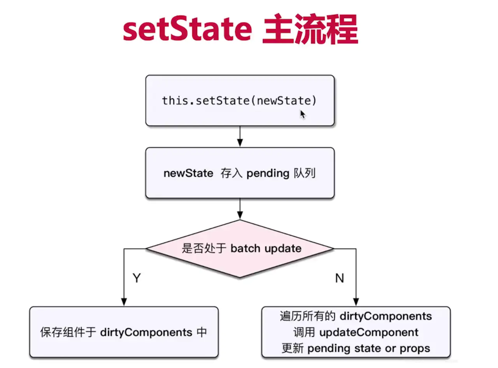
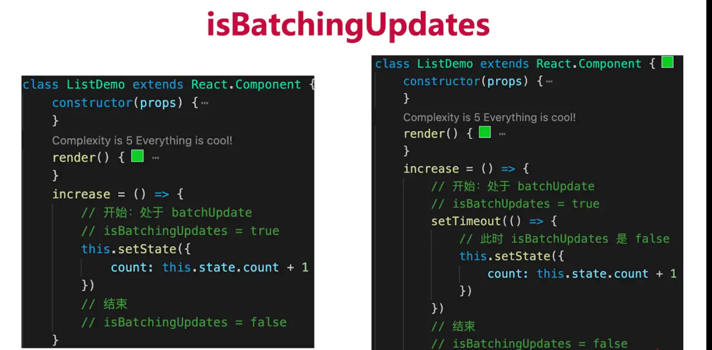

# setState
- 有时异步（普通使用），有时同步（setTimeout, DOM事件）

- 有时合并（对象形式），有时不合并（函数形式），比较好理解（类似 Object.assign），函数无法合并

## setState 异步调用
React 可以“管理”的入口，比如
1. 生命周期函数
2. react合成事件

## setState 同步调用
React“管不到”的入口，比如
1. setTimeout
2. DOM事件

## setState流程
看this.setState()是否是异步，看 isBatchingUpdates 的状态，为 true 就是异步，为 false 就是同步  

