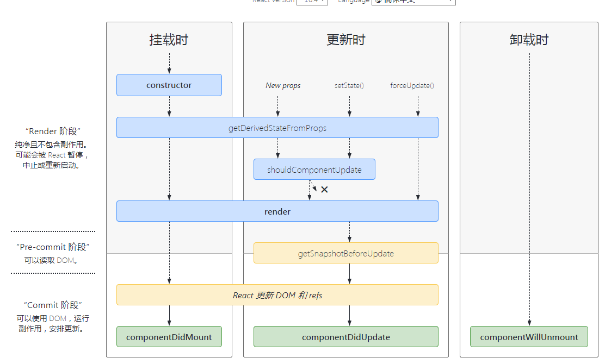

https://projects.wojtekmaj.pl/react-lifecycle-methods-diagram/

# 挂载

1. constructor()
2. static getDerivStateFromProps()
3. render()

# 更新

1. static getDerivStateFromProps()
2. shouldComponentUpdate()
3. render()
4. componentDidUpdate()

# 卸载

1. componentWillUnmount()

# 错误处理

1. static getDerivedStateFromError()
2. componentDidCatch()

