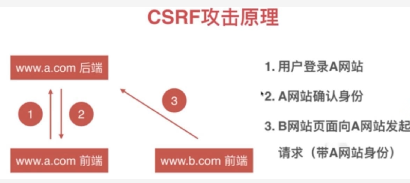

# CSRF（跨站请求伪造）

跟cookie息息相关。

首先HTTP Cookie（也叫 Web Cookie 或浏览器 Cookie）是服务器发送到用户浏览器并保存在本地的一小块数据，
它会在浏览器下次向同一服务器再发起请求时被携带并发送到服务器上。
通常，它用于告知服务端两个请求是否来自同一浏览器，如保持用户的登录状态。
Cookie 使基于无状态的HTTP协议记录稳定的状态信息成为了可能。

CSRF就是利用cookie这一个特点进行攻击的。

## 攻击原理

一个典型的 CSRF攻击流程如下：

1.  受害者登录网站a，保留了登录凭证（cookie）；
2.  攻击者诱导受害者访问危险网站b；
3.  危险网站b向网站a发送一个正常的请求，浏览器会默认携带存放在网站a下的 cookie；
4.  网站a在接收到请求后，对请求进行验证，确认是受害者的凭证，误以为是受害者自己发送的请求；
5.  网站a以受害者的名义，执行了危险请求中请求的操作；


## 攻击手段

在网站b，通过: form表单, img标签向 a 网站发送请求。

form表单
```jsx
<form action="http://www.a.com" method="post">

</form>
```
img标签
```jsx
 
```

## 防御

由于b网站向a网站发送请求，有以下特征：

- 携带a网站的cookie
- 不经过a网站前端
- referer的头为 http://www.b.com

针对以上特征，我们可以做

- 服务器设置 cookie 的SameSite属性，来限制从第三方网站带过来的cookie
```
Set-Cookie: __Host-sess=123; path=/; Secure; HttpOnly; SameSite
```

- 前端设置 **验证码** 或者 **token**

由于b网站的请求拿不到a网站的 验证码 或者 token，因此请求失败。

原理就是服务器会下发 验证码或者token 给浏览器，同时在服务器也保留样的值。

浏览器在请求时必须要带上服务器下发的 验证码或者token。

服务器端进行验证，如果没有或者不匹配，则请求失败。

- 服务器检查referer头属性

```js
if(!/^https?:\/\/www.a.com/.test(referer)){
  throw new Error('不是来自a网站的请求')
}
```

