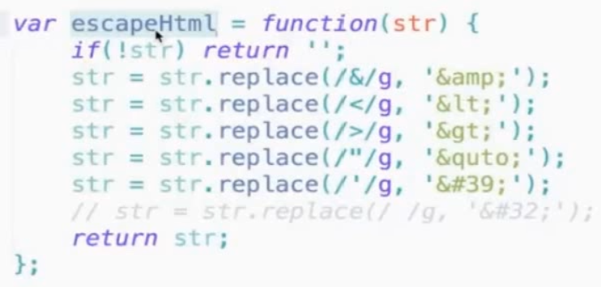
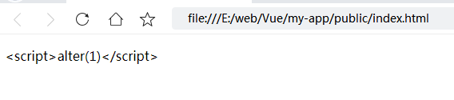
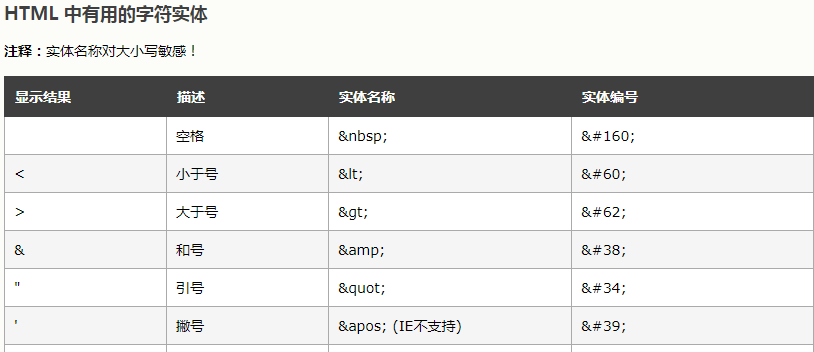
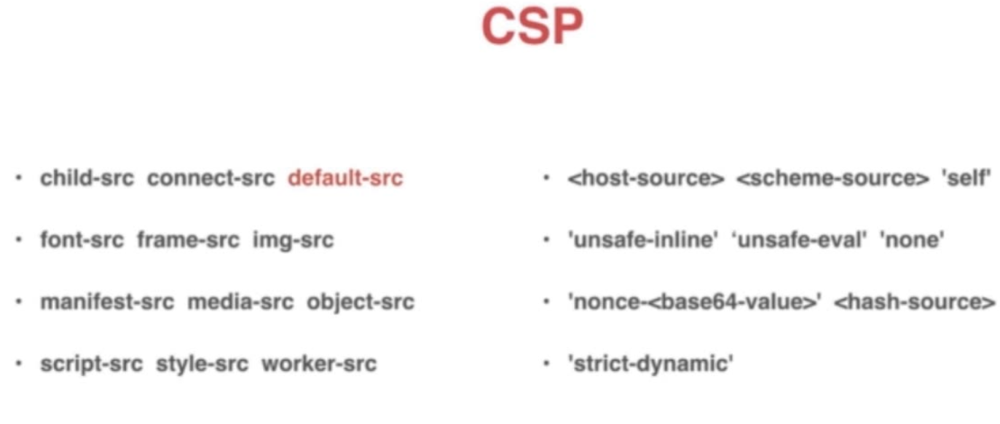

# XSS
有用户输入的地方就有可能发生XSS攻击。

## XSS分类
1. 反射型。通过URL参数直接注入。
2. 存储型。存储到DB后读取时注入。

### 反射型
对于反射型的XSS，通常通过短网址类来传播。

例如带有script的url： http://abc.com?from=\<script>alert(1)\</script>

生成短网址后可能为 https://4m.cn/c69o6

生成短网址网站有 https://4m.cn/

### 存储型
存储型的xss危害更大，因为传播时不用改变url。
通过评论啊，留言啊之类的写入数据库。

## XSS 攻击注入点
1. HTML节点内容
2. HTML属性
3. JavaScript代码
4. 富文本

### HTML节点内容注入
```
<div>
  #{content}
</div>
```
如果content的值是 \<script>alert(1)\</script>
则在页面上显示
```
<div>
  <script>alert(1)</script>
</div>
```

### HTML属性注入
```

```
如果 image的值是 "1 onerror="alert(1)
则在页面上显示
```

```

### JavaScript代码注入
```
<script>
    var data = "#{data}";
<script/>
```
如果 data 的值是 hello";alert(1);"
则在页面上显示
```
<script>
    var data = "hello";alert(1);"";
<script/>
```

### 富文本注入
由于富文本就是带有格式的HTML，因此风险更高。


## XSS防御
1. 浏览器自带防御
2. 代码中防御
3. CSP 内容安全策略

### 浏览器自带防御
一些浏览器可以防御反射型并通过HTML内容和属性注入的脚本.

### 代码中防御
对于HTML节点内容注入，HTML属性注入，JavaScript代码注入的防御，

就是通过转义 &, <, >, ", ' 为HTML实体实现的。

对 & 的转义必须放在第一




转义为HTML实体后，上面的 <, >, &, ", ' 就会只显示他们自己。

比如 

```jsx
<p>&ltscript&gtalert(1)&lt/script&gt</p>
```

页面展示为下面，不会弹出alert





对于通过富文本注入的，通常通过白名单或者第三方库防御。

原理是：
1. 定义允许输入的标签，属性的白名单。
2. 使用cheerio先解析用户输入的HTML
3. 遍历每个标签，属性，如果不在白名单里则删除。
4. 返回过滤后的HTML

## CSP

CSP是http的头属性 Content-Security-Policy 
作用就是指定哪些内容可以执行。



左边定义的是可执行内容的类型。

右边定义的是防御的策略。

例如 `script-src 'self'`的意思是：只能执行同域下的脚本。

script-src指定 要执行的内容为script脚本

self指定 只能是同域下的可以执行。

default-src 是个fallback选项，当没有指定具体执行的内容类型，则应用全部类型。
可以通过设置具体类型来覆盖。

```
Content-Security-Policy: default-src 'self'; script-src https://example.com
```

将与以下内容相同：
```
Content-Security-Policy: connect-src 'self'; 
                         font-src 'self'; 
                         frame-src 'self'; 
                         img-src 'self'; 
                         manifest-src 'self'; 
                         media-src 'self'; 
                         object-src 'self'; 
                         script-src https://example.com; 
                         style-src 'self'; 
                         worker-src 'self'
```


