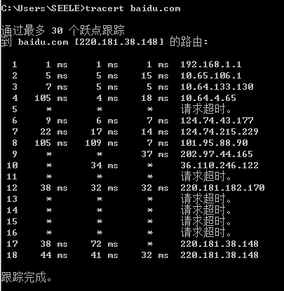
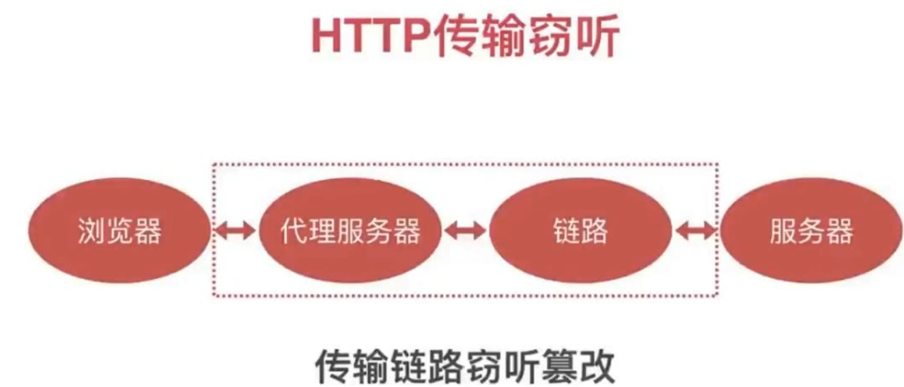
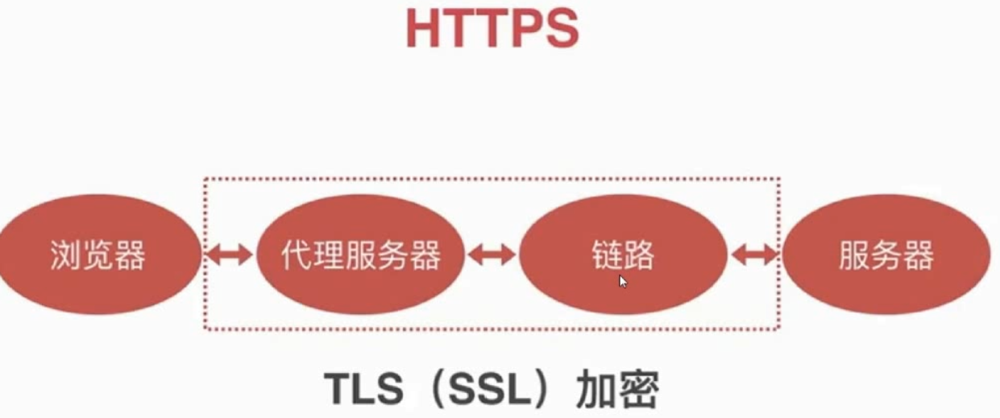
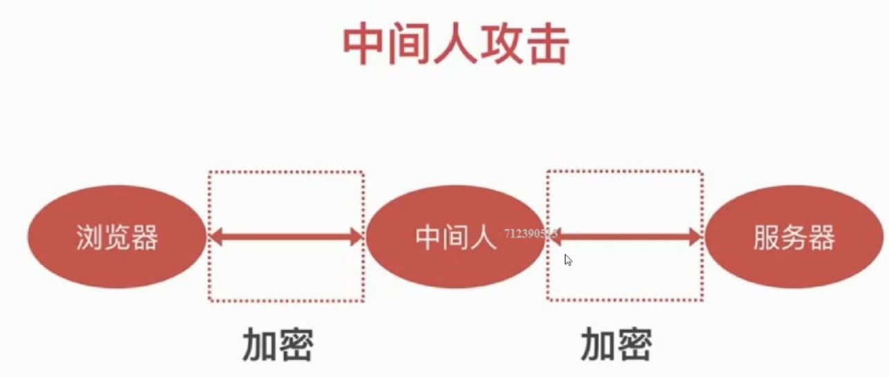
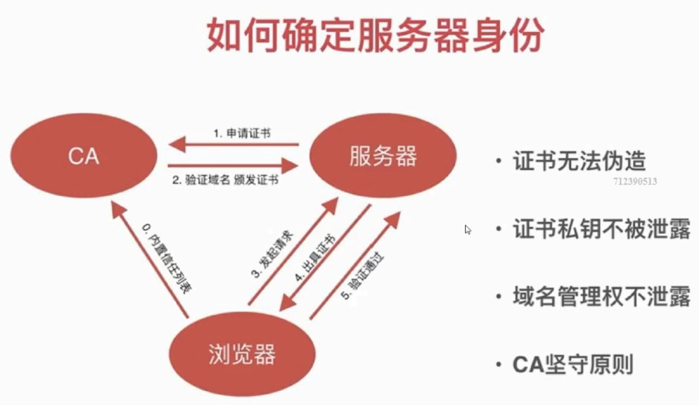

# 传输安全

在Windows下使用 `tracert baidu.com` 查看IP数据包访问目标时所选择的路径。

由于 http传输是不安全的（明文传输），在所经过的路径就可能存在 **窃听**，**篡改**。

1. 窃听
 
   密码，敏感信息

2. 篡改

    运营商劫持 广告
    
    WiFi劫持
    
## 防御

使用 HTTPS 代替HTTP。

HTTPS是建立在 TLS（SSL）协议之上的。HTTPS是加密传输的。

### 中间人攻击
即使使用了HTTPS，也有可能发生中间人攻击。
因为浏览器并不知道服务器的真的还是假的。

一般流程如下：

*   服务端请求客户端，请求被中间人拦截；
*   服务器向客户端发送公钥；
*   中间人截取公钥，保留在自己手上，并伪造一个公钥发送给客户端；
*   客户端收到伪造的公钥后，生成加密密钥发送给服务端；
*   中间人通过私钥解密得到真密钥，同时生成假的密钥，用服务端的公钥加密后发送给服务端；
*   服务端收到请求后用私钥解密得到假的密钥，然后用假的密钥加密明文数据传输给客户端。

### 防御中间人攻击

使用证书机制

CA： 证书颁发机构

服务器首先要到CA去申请证书。
当然这个CA要确保在浏览器信任列表中，如果不在则要安装。

申请证书一般是收费的。
免费的有 let's encrypt https://letsencrypt.org/getting-started/ 

### 服务器如何申请证书
### 服务器如何部署证书  

