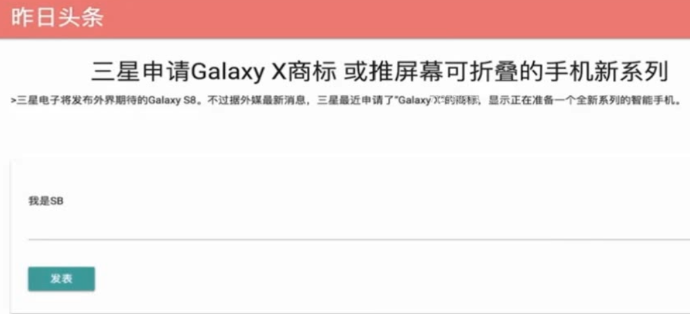
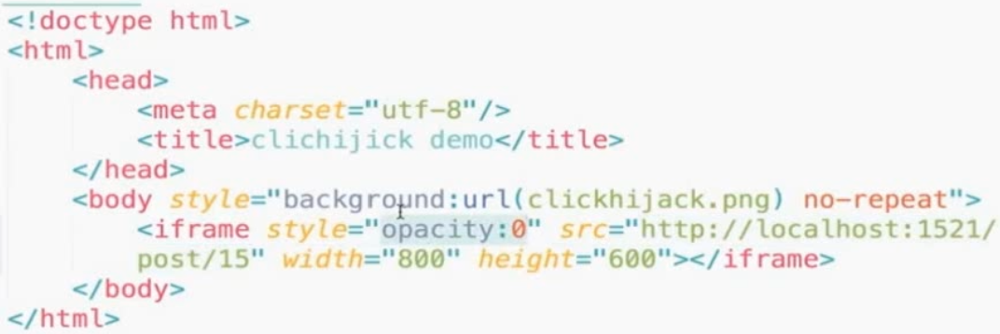
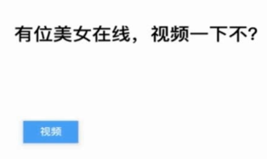
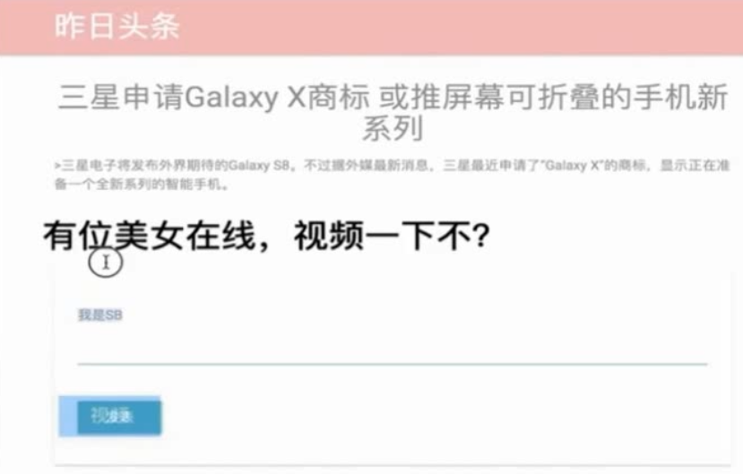

# 点击劫持 (clickjacking)

## 原理
攻击网站使用 iframe包装目标网站，并把透明设为0

1. 目标网站


2. 攻击网站


3. 结果为


4. 把透明设为0.5 结果为


## 防御

禁止网站被iframe内嵌。

1. 使用js禁止内嵌（不推荐）
```js
// 一个没有被内嵌的网站
// top == window
// top.location == window.location


// 一个被内嵌的网站
// top为攻击网站，window为目标网站
// 如果不相等，则说明被内嵌了，那么就跳转到目标网站
if(top.location != window.location){
  top.location = window.location
}
```


2. X-Frame-Options（推荐）

X-Frame-Options HTTP 响应头是用来给浏览器指示允许一个页面可否在 
\<frame>, \</iframe> 或者 \<object> 中展现的标记。

网站可以使用此功能，来确保自己网站的内容没有被嵌套到别人的网站中去，也从而避免了点击劫持 (clickjacking) 的攻击。

X-Frame-Options三个参数:

- DENY

表示该页面不允许在frame中展示，即便是在相同域名的页面中嵌套也不允许。

- SAMEORIGIN

表示该页面可以在相同域名页面的frame中展示。

- ALLOW-FROM uri

表示该页面可以在指定来源的frame中展示。


