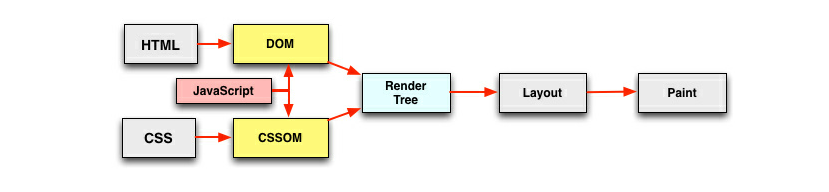
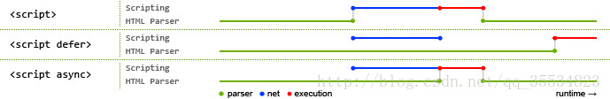

# 页面加载渲染的过程


1.  解析 HTML，生成 DOM 树（DOM）
2.  解析 CSS，生成 CSSOM 树（CSSOM）
3.  将 DOM 和 CSSOM 合并，生成渲染树（Render-Tree）
4.  计算渲染树的布局（Layout）
5.  将布局渲染到屏幕上（Paint）

特点是:
1. 顺序执行、并发加载

HTML从上到下顺序执行，遇到需要加载的CSS，JS并发加载。

通过词法分析，通过HTML生成Token对象（当前节点的所有子节点生成后，才会通过next token获取到当前节点的兄弟节点），最终生成Dom Tree。
浏览器中可以支持并发请求，不同浏览器所支持的并发数量不同（以域名划分），以Chrome为例，并发上限为6个。
优化点： 把CDN资源分布在多个域名下

- html和css由GUI负责加载解析
- JS脚本由JS引擎加载解析
- GUI线程和JS线程是互斥的

2. 对于CSS:
    
    CSS放在head中会阻塞页面的渲染（也就是说页面的渲染会等到css加载完成）,但不阻塞DOM解析
    
    CSS阻塞JS的执行 （因为GUI线程和JS线程是互斥的，因为有可能JS会操作CSS）
    
    CSS不阻塞外部脚本的加载（不阻塞JS的加载，但阻塞JS的执行，因为浏览器都会有预先扫描器）
3. 对于JS:

    直接引入的JS会阻塞页面的渲染（GUI线程和JS线程互斥），并且阻塞DOM解析
    
    JS不阻塞资源的加载(这有赖于chrome的预加载机制)
    
    JS顺序执行，阻塞后续JS逻辑的执行


## 结论：html加载和渲染的一些优化点

1. CSS样式放在head中，而不是body中
2. 用link代替@import引入css
3. js脚本放在body标签尾部
4. 合理使用js的异步加载能力


### 为什么 CSS样式放在head中，而不是body中

1. css放在body标签尾部时, DOMTree构建完成之后便开始构建RenderTree, 并计算布局渲染网页, 
等加载解析完css之后, 开始构建CSSOMTree, 并和DOMTree重新构建RenderTree, 重新计算布局渲染网页.

2. css放在head标签中时, 先加载css, 之后解析css构建CSSOMTree, 
于此同时构建DOMTree, CSSOMTree和DOMTree都构建完毕之后开始构建RenderTree, 计算布局渲染网页。

    对比两者, css放在head标签中比css放在body标签尾部少了一次构建RenderTree, 一次计算布局和一次渲染网页, 因此性能会更好;
     并且css放在body标签尾部时会在网页中短暂出现"裸奔"的HTML, 这不利于用户体验。

https://zhuanlan.zhihu.com/p/46387951

### 用link代替@import引入css

1. 从属关系区别

    @import是 CSS 提供的语法规则，只有导入样式表的作用；

    link是HTML提供的标签，不仅可以加载 CSS 文件，还可以定义 RSS、rel 连接属性等。

2. 加载顺序区别

    加载页面时，link标签引入的 CSS 被同时加载；@import引入的 CSS 将在页面加载完毕后被加载。

3. 兼容性区别

    @import是 CSS2.1 才有的语法，故只可在 IE5+ 才能识别；

    link标签作为 HTML 元素，不存在兼容性问题。

4. DOM可控性区别

    可以通过 JS 操作 DOM ，插入link标签来改变样式；
    由于 DOM 方法是基于文档的，无法使用@import的方式插入样式。

5. 权重区别(该项有争议，下文将详解)

    link引入的样式权重大于@import引入的样式。

 
@import的书写方式

```
<style type="text/css">
@import 'style.css' //Windows IE4/ NS4, Mac OS X IE5, Macintosh IE4/IE5/NS4不识别
@import "style.css" //Windows IE4/ NS4, Macintosh IE4/NS4不识别
@import url(style.css) //Windows NS4, Macintosh NS4不识别
@import url('style.css') //Windows NS4, Mac OS X IE5, Macintosh IE4/IE5/NS4不识别
@import url("style.css") //Windows NS4, Macintosh NS4不识别
</style>
```

其中，@import url(style.css) 和@import url("style.css")是最优的选择，兼容的浏览器最多。
从字节优化的角度来看@import url(style.css)最值得推荐。

 link的书写方式

<link href="style.css" rel="stylesheet" type="text/css">  
另外link还有其他的一些用途，比如引入图标

<link rel="shortcut icon" href="/favicon.ico" type="image/x-icon" />

### js脚本放在body标签尾部
CSS 和 JS 都会阻塞 HTML 的渲染，如果这些 CSS 和 JS 需要加载和解析很久的话，那么页面就空白了。
所以 JS 文件要放在底部，等 HTML 解析完了再加载 JS 文件。

但是为什么 CSS 还是要放在头部呢?
因为如果先加载 HTML 再加载 CSS，会让用户第一时间看到的页面是没有样式的、丑陋的.
为了避免这种情况，所以要降 CSS 放在文件头部。
不过目前这些操作都已经可以交给打包工具来完成。

### 合理使用js的异步加载能力
#### 异步加载方式

*   defer
*   async

#### 异步加载区别

1.  defer 是 HTML 解析完才会执行。
如果是多个，按照加载的顺序依次执行。defer 脚本会在 DOMContentLoaded 和 load 事件之前执行
2.  async 会在脚本加载完之后立即执行。
如果是多个，执行顺序和加载顺序无关。async 会在 load 事件之前执行，
但并不能确保与 DOMContentLoaded 的执行先后顺序




