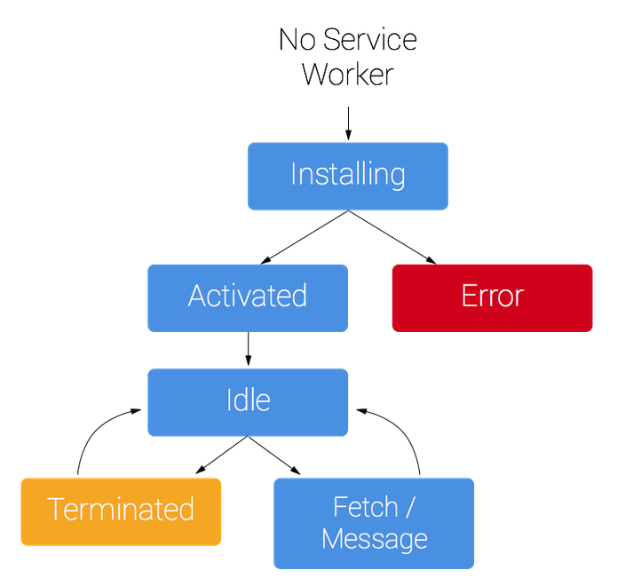

# Cookie
因为HTTP请求无状态，所以需要cookie去维持客户端状态。

优化:

cdn的域名和主站域名要分开。 因为相同域名下的请求，会携带cookie。
而请求部署在cdn上的静态文件时，没必要携带cookie。

# LocalStorage，SessionStorage
Cookie存在的目的是去维持客户端状态，而不是做客服端信息存储。
由于cookie能存储的大小只有4KB左右，
所以使用LocalStorage或者SessionStorage 代替cookie来做客服端信息存储。

LocalStorage： 
- HTML5设计出来专门用于浏览器存储的
- 不会过期
- 大小为5M左右
- 仅在客户端使用，不和服务端进行通信
- 接口封装较好
- 浏览器本地缓存方案（緩存css，js，图片）

SessionStorage：
- 会话级别的浏览器存储
- 对于表单信息的维护，刷新页面后表单填写的内容不被丢失。

# IndexedDB

IndexedDB 是一种低级API，用于客户端存储大量结构化数据。
该API使用索引来实现对该数据的高性能搜索。
虽然 Web Storage 对于存储较少量的数据很有用，但对于存储更大量的结构化数据来说，
这种方法不太有用。IndexedDB提供了一个解决方案。
为应用创建离线版本

# ServiceWorker
Service Worker 是一个在后台运行脚本，不会阻塞JS的执行。

作用：
- 离线应用（利用ServiceWorker拦截和处理网络请求）
```js
// 监听fetch事件
// 对match到的请求，先从缓存中拿。如果没有结果，则请求。
self.addEventListener('fetch', function(event) {
  event.respondWith(
    caches.match(event.request).then((res)=>{
      if(res){
        return res;
      } else {
        // fetch 
      }
    })
  )
})
```
- 处理耗时计算（利用ServiceWorker能和页面通信的能力）
```js
// 一个serviceWork可以管理多个tab页面(clientList)
// 通过client.postMessage();向页面发送消息
self.clients.matchAll().then((clientList)=>{
  clientList.forEach((client)=>{
    client.postMessage();
  })  
});
```
- 缓存静态资源 （利用cacheStorage）
```js
// 在serviceWorker注册时，把需要缓存的资源加入到caches
// 可以监听fetch事件，实现下次请求从缓存中拿。
self.addEventListener('install', function(event) {
  event.waitUntil(
    caches.open('app-cache').then((cache)=>{
      return cache.addAll([
        './app.js'
      ])  
    })
  )
})
```
service-worker 声明周期


# PWA
PWA (Progressive Web Apps) 是一种 Web App 新模型，
并不是具体指某一种前沿的技术或者某一个单一的知识点，
这是一个渐进式的 Web App，是通过一系列新的 Web 特性，
配合优秀的 UI 交互设计，逐步的增强 Web App 的用户体验。

弱网络，离线的环境下仍然可以访问。

使用Lighthouse插件检测网站是否支持PWA。