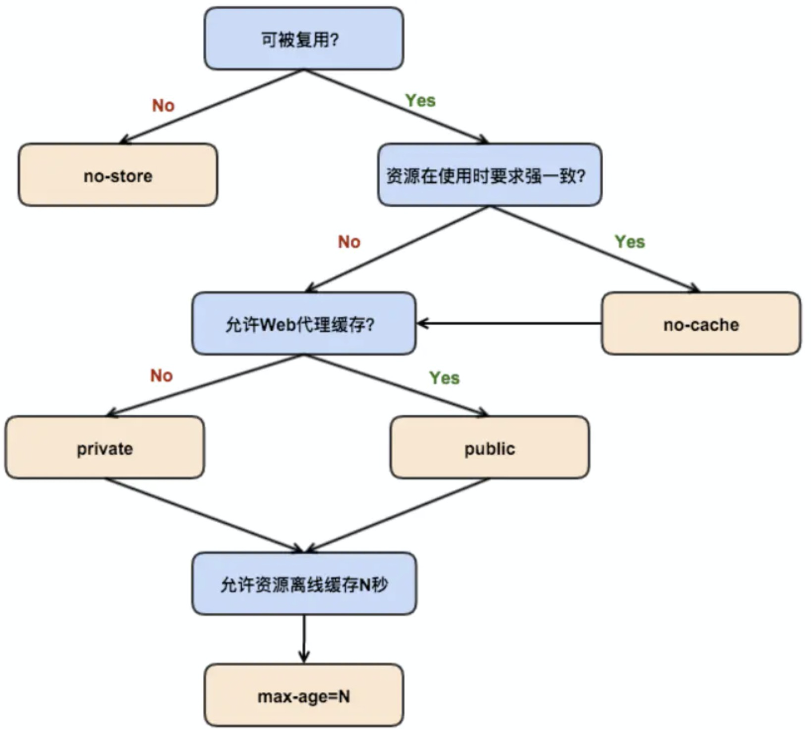
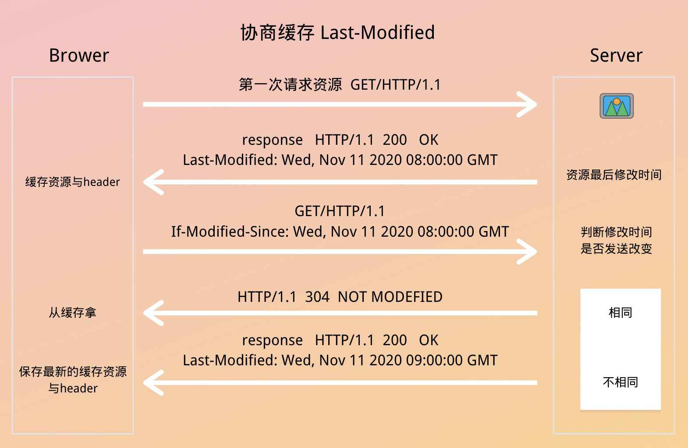
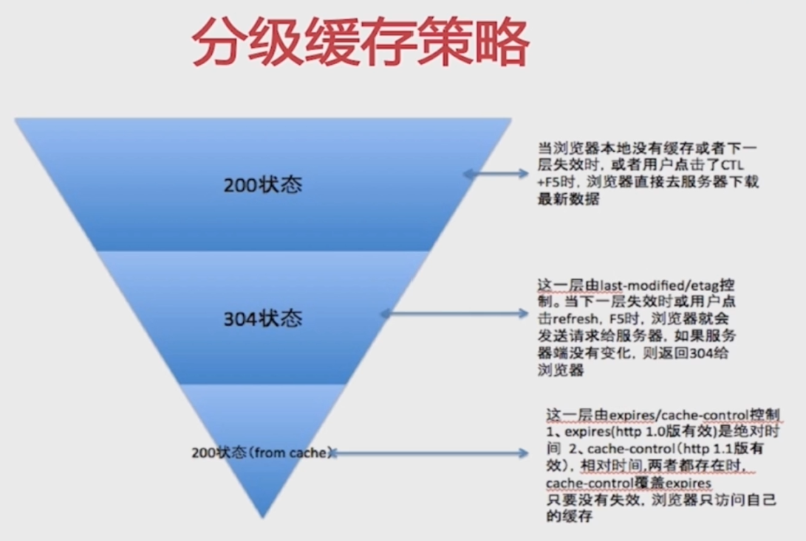

具体缓存策略是由服务器来指定的。

浏览器缓存这一块可以精确地回答一下几个大方面：

*   缓存的类型（强缓存 or 协商缓存）
*   缓存位置（Service Worker、Memory Cache...）
*   缓存过程分析
*   缓存策略的实际场景应用


# 缓存的类型

首先从缓存的类型上说，缓存分为 **强缓存** 和 **协商缓存**

强缓存是 **不需要发送 HTTP 请求的**，而协商缓存需要。

也就是说，在发送 HTTP 请求之前，浏览器会先检查一下强缓存，如果命中直接使用，否则就进入下一步。

## 强缓存

浏览器检查强缓存的方式主要有两个字段：

*   HTTP/1.0 时期使用 Expires
*   HTTP/1.1 时期使用 Cache-Control

### Expires

Expires 字面意思是有效期，所以它表示的是一个具体的时间，例如：

```wiki
Expires: Wed, Nov 11 2020 08:00:00 GMT
```

表示的是这个资源将在 2020年11月11日 8 点过期，过期就得重新向服务端发送请求。

很有意思的是，通常情况下服务端的时间与客户端的时间其实是并不一致的，那么如果设置了 Expires 字段就很有可能造成缓存失效，
因此这种方式并不准确，所以在 HTTP/1.1 被摒弃了。

### Cache-Control

摒弃了 Expires 之后，HTTP/1.1 采用了 Cache-Control 这个重要规则，它设置了一个具体的过期时长，
其中的一个属性是 max-age。

```wiki
Cache-Control: max-age=300
```

这表示当前资源会在 300s 后过期。

Cache-Control 不仅仅含有一个 max-age 的属性，他还有很多用法， 甚至还可以采用组合的方式：

```wiki
Cache-Control: public, max-age=300
```

下面列举一些常用指令：

*   public：客户端和代理服务器都可以缓存，响应可以被中间任何一个节点缓存
*   private：这个是 Cache-Control 的默认取值，只有客户端可以缓存，中间节点不允许缓存
*   no-cache：表示不进行强缓存验证，而是用协商缓存来验证
*   no-store：所有内容都不会被缓存，既不使用强缓存，也不使用协商缓存
*   max-age：表示多久时间之后过期
*   s-max-age：作用同 max-age，但是表示代理缓存，且优先级更高
*   max-stale：能容忍的最大过期时间
*   min-fresh：能容忍的最小新鲜度



### 对比

*   Expires 产于 HTTP/1.0，而 Cache-Control 产于 HTTP/1.1
*   Expires 设置的是一个具体的时间，Cache-Control 可以设置除时间以外的其他属性
*   两者同时存在时，Cache-Control 优先级更高
*   在不支持 HTTP/1.1 的环境下，Expires 就会发挥作用，所以现阶段的存在是为了做一些兼容处理

## 协商缓存

上面我们介绍了强缓存，如果强缓存失效，则会进入协商缓存。

协商缓存概括起来就是浏览器会携带缓存标识（tag）向服务端发送请求，服务端会根据缓存标识（tag）来决定是否使用缓存。

所以对于服务器来说，返回的结果会有两种：

*   协商缓存生效，返回 304 状态码和 Not Modified（空的响应体）
*   协商缓存失效，返回 200 和请求结果

协商缓存分为 Last-Modified 和 ETag 两个字段控制。

### Last-Modified 和 If-Modified-Since

从字面意思上我们可以看出，Last-Modified 表示的是资源最后的修改时间，它的实现方式是：

1.  浏览器第一次向服务器请求该资源
2.  服务器在返回这个资源的同时，会在响应头中添加 Last-Modified 的字段，值为最后的修改时间
3.  当浏览器接收后，缓存文件和这个 header
4.  当下一次浏览器再次发送请求请求该资源的时候，检测到有 Last-Modified 这个 header，就会在请求头中添加 If-Modified-Since 这个字段，值为 Last-Modified
5.  服务器接收到请求之后，根据 If-Modified-Since 与服务器的这一资源的最后修改时间做对比
6.  如果结果相同，则返回 304 状态码和一个空的响应题，告诉浏览器使用缓存
7.  反之，返回 200 状态码和请求的资源，同时在响应头中更新 Last-Modified 



### ETag 和 If-None-Match

Etag 的原理其实和 Last-Modified 相似，但是它是根据一个唯一标识来进行判断。

当浏览器请求服务器资源的时候，服务器会根据当前文件的内容，给文件生成一个唯一的标识，若是文件发生修改，则标识也会修改。

服务器在响应请求的时候，会在响应头添加一个 ETag 的字段，值为这个文件当前的唯一标识。

浏览器在接收到文件并缓存文件和 请求的响应头。

在下一次请求这个资源的时候，浏览器会在请求头上加一个 If-None-Match 的字段，值为 ETag。

服务器用请求头上的值和本地资源的值进行对比，如果命中则返回 304 告知浏览器使用本地缓存，否则返回 200 和最新的资源文件。


### 两者对比

首先对于 Last-Modified：

*   仅仅改变的修改时间，但是内容并不改变。导致缓存失败；
*   某些文件修改非常频繁，比如在秒以下的时间内进行修改，(比方说1s内修改了N次)，
If-Modified-Since能检查到的粒度是s级的，这种修改无法判断(或者说UNIX记录MTIME只能精确到秒)
*   某些服务器不能精确的得到文件的最后修改时间；

对于 ETag：

*   性能上会比 Last-Modified 差，因为只要文件发生修改，就会重新生成一个新的 hash 值。

综上：

*   准确度上，ETag 要高于 Last-Modified
*   性能上 Last-Modified 更好
*   两者都支持的话，ETag 优先级更高

整体流程



# 缓存位置

在上面👆我们已经介绍完了缓存的类型😄, 但是之前也提到过了, 若是命中了 **强缓存** 或者服务器返回了 `304` 之后,
要浏览器从缓存中过去资源, 那这些缓存具体是存储在哪里呢?

从优先级上说，缓存位置分为以下四种：

*   Service Worker
*   Memory Cache
*   Disk Cache
*   Push Cache

## Service Worker

Service Worker 是运行在浏览器背后的独立线程，也就是说他脱离了浏览器的窗体，无法直接访问 DOM。
功能上主要能实现：离线缓存、消息推送、网络代理等。比如离线缓存就是 **Service Worker Cache**。

简单来说，它有以下几个特点：

*   借鉴了 Web Worker
*   使用 Service Worker 会涉及请求拦截，所以需要用 HTTPS 协议来保证安全，传输协议必须是 HTTPS
*   与浏览器其他内建的缓存机制不同，它可以让我们自由的控制缓存那些文件、如何匹配读取缓存，且缓存是持续性的
*   Service Worker 同时也是 PWA 的重要实现机制

## Memory Cache

内存缓存，存储的主要是当前网页上已经抓取到的资源，比如网页上已经下载的样式、脚本、图片等。

Memory Cache 的特点是：

*   读取效率高，但是持续时间短，会随着进程的释放而释放（一旦关闭 Tab 页面就会被释放，甚至有时候没关闭前，排在前面的缓存就已经失效了）
*   几乎所有的请求资源都能进入 memory cache，细分来说主要分为 **preloader** 和 **preload** 这两块
*   在从 memory cache 读取缓存时，浏览器会忽视 Cache-Control 中的一些 max-age、no-cache 等头部设置，除非设置了 no-store 这个头部设置

### preloader

上面提到的 preloader 是页面优化的常见手段之一，它的主要作用是 **在浏览器打开一个网页的时候，能够一边解析执行 js/css，一边去请求下一个资源**，
而这些被 preloader 请求来的资源就会被放入 memory cache 中，供之后的解析执行操作使用。

### preload

preload 和 preloader 长得非常相似，它能够显式指定预加载的资源，这些资源也会被放进 memory cache 中，例如

```html
<link rel="preload">
```

## Disk Cache

Disk Cache，也叫 HTTP Cache，是存储在硬盘中的缓存，所以它的特点是持续时间长，是实际存在于文件系统中的缓存。

从存储效率上说，它比内存缓存慢，但是优势在于存储容量大，持续时间更长。

在所有浏览器缓存中，Disk Cache 是覆盖面最大的，它会根据前面我们提到的 HTTP header 中的缓存字段来判断哪些资源需要缓存，哪些资源不需要请求而直接使用，
哪些已经过期了需要重新请求获取。

若是命中缓存之后，浏览器会从硬盘中直接读取资源，虽然没有从内存中读取快，但是仍然比网络下载快。

前面提到的强缓存和协商缓存也是属于 Disk Cache，他们最终都存储在硬盘里。

Disk Cache 和 Memory Cache 之间的对比：

*   比较大的 JS、CSS 文件会被丢在硬盘中存储，反之则存储在内存中
*   当前系统内存使用率比较高的时候，文件优先进入磁盘

## Push Cache

Push Cache（推送缓存），它是浏览器缓存的最后一道防线，当以上三种缓存都没有命中的时候，它才会被使用。

它只会在会话（Session）中存在，一旦会话结束就会被释放，并且缓存时间非常短，在 Chrome 浏览器中只有 5 分钟。

另外由于它是 HTTP/2 的产物，所以国内普及程度不高，这里贴上一个总结：

*   所有资源都能被推送，并且能够被缓存，但是 Edge 和 Safari 支持相对比较差
*   可以推送 no-cache 和 no-store 的资源
*   一旦连接被关闭，Push Cache 就会被释放
*   多个页面可以使用同一个 HTTP/2 的连接，也就可以使用同一个 Push Cache。
这主要还是依赖浏览器的实现，出于对性能的考虑，有些浏览器会对相同域名但不同 tab 标签使用同一个 HTTP 请求
*   Push Cache 中的缓存只能被使用一次
*   浏览器可以拒绝接受已经存在的资源推送
*   你可以给其他域名推送资源


# 缓存过程分析

上面已经介绍了缓存类型和缓存位置，那么浏览器是如何处理缓存？

从浏览器发起 HTTP 请求到获得请求结果，可以分为以下几个步骤：

1.  浏览器第一次发起 HTTP 请求，在浏览器缓存中没有发现缓存结果和缓存标识
2.  因此向服务器发起 HTTP 请求，获得该请求的结果以及缓存规则（也就是 Last-Modified 或者是 ETag）
3.  浏览器把响应内容存入 Disk Cache，把响应内容的引用存入 Memory Cache
4.  把响应内容存入 Service Worker 的 Cache Storage（如果 Service Worker 的脚本调用了 cache.put()）

下一次请求相同资源的时候：

1.  调用 Service Worker 的 fetch 事件响应
2.  查看 memory cache
3.  查看 disk cache，这里细分为：
    *   有强缓存且未失效，则是用强缓存，不请求服务器，返回的状态码都是 200
    *   有强缓存且已失效，使用协商缓存判断，是返回 304 或者是 200

# 浏览器的行为
所谓浏览器的行为，指的就是用户在浏览器如何操作时，会触发怎样的缓存策略。主要有 3 种：

- 打开网页，地址栏输入地址： 浏览器发现该资源已经缓存了而且没有过期（通过Expires头部或者Cache-Control头部），
没有跟服务器确认，而是直接使用了浏览器缓存的内容（disk cache强缓存），否则进行网络请求

- 普通刷新 (F5)：因为 TAB 并没有关闭，因此 memory cache 是可用的，会被优先使用(如果匹配的话)。其次才是 disk cache协商缓存。

- 强制刷新 (Ctrl + F5)：浏览器不使用缓存，因此发送的请求头部均带有 Cache-control: no-cache(为了兼容，还带了 Pragma: no-cache)。
服务器直接返回 200 和最新内容

# 缓存策略的实际使用场景

## 不常变化的资源

对于不常变化的资源：

```wiki
Cache-Control: max-age=31536000
```

通常给 Cache-Control 设置一个很大的值（比如一年），但是有时候为了解决更新问题，我们需要在文件上添加一个 hash，这样就达到了更改引用 URL 的目的。

## 常变化的资源

对于经常变化的资源：

```wiki
Cache-Control: no-cache
```

我们可以不使用强缓存，每次都向浏览器发送请求，然后配合 ETag 或者 Last-Modified 来验证资源缓存是否有效。
