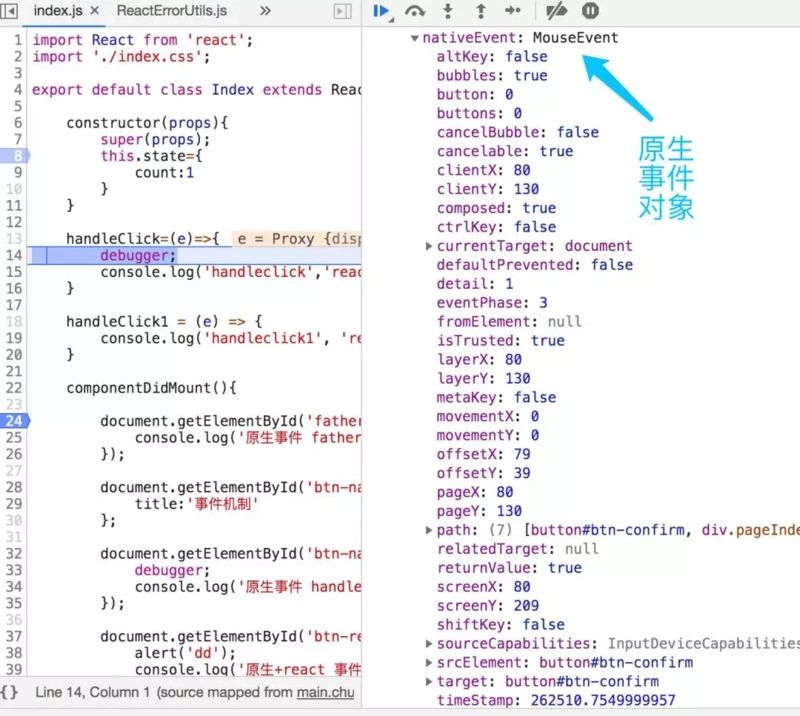
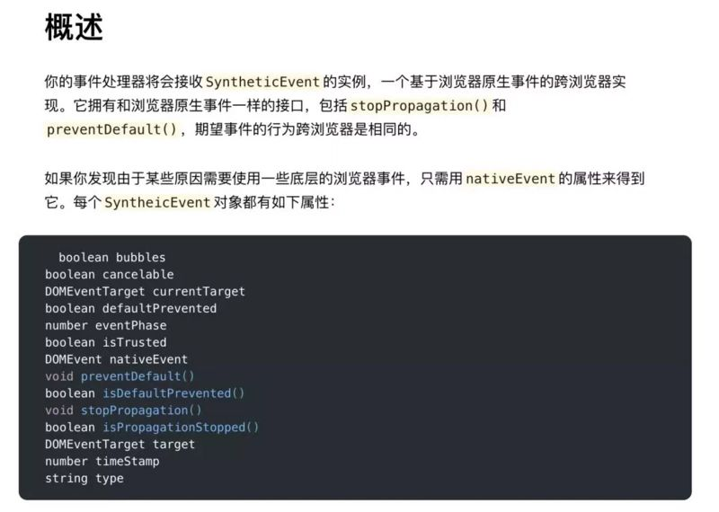
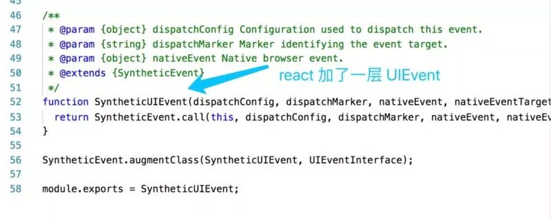
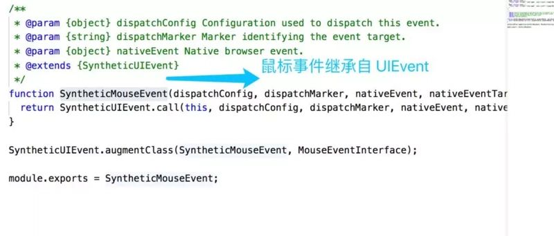
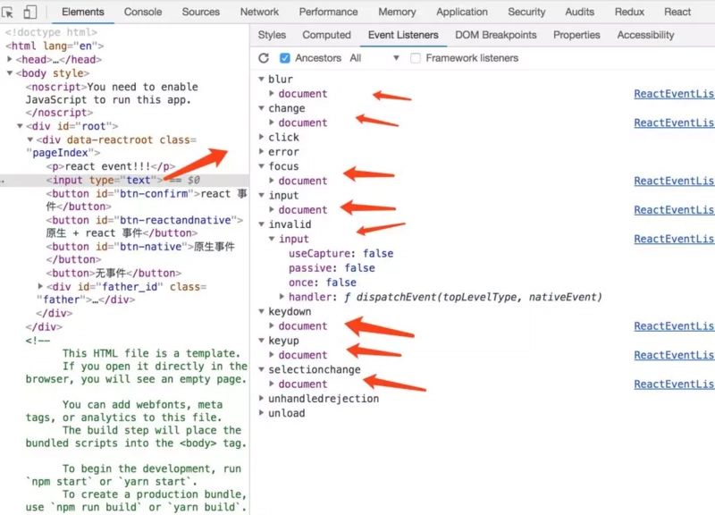

# 初步理解

## 表象理解

先回顾一下 React 事件机制基本理解，React 自身实现了一套自己的事件机制，包括事件注册、事件合成、事件冒泡、事件派发等，虽然和原生是两码事，但是也是基于浏览器的事件机制下完成的。

我们都知道 React 的所有事件并没有绑定到具体的 DOM 节点，而是绑定到 document 上，然后由统一的事件处理程序来处理，同时也是基于浏览器的事件机制（冒泡），所有节点的时间都会在 document 上触发。

## 试想一下

如果一个节点同时绑定了合成和原生事件，那么禁止冒泡后执行关系是怎样？

因为合成事件的触发是基于浏览器的事件机制来实现的，通过冒泡机制冒泡到最顶层元素，然后再由 dispatchEvent 统一去处理。

**得出结论**：

原生事件阻止冒泡肯定会阻止合成事件的触发，合成事件的阻止冒泡不会影响原生事件。

原因在于，浏览器的事件执行机制是执行在前，冒泡在后，所以在原生事件中阻止冒泡会阻止合成事件的执行，反之不成立。

综上，两者最好不要一起使用，避免出现一些奇怪的问题。

## 意义

React 将事件全部统一交给 document 来委托处理的原因是：

1.  减少内存消耗，提高性能，不需要注册那么多的事件，一种事件只需要在 document 上注册一次即可
2.  统一规范，用于解决兼容性问题，简化事件逻辑
3.  对开发者更加友好


# 对合成的理解

既然我们对 React 的事件机制有了初步的了解，那么可以知道合成事件并不是简单的合成和处理，从广义上还包括：

*   对原生事件的封装
*   对某些原生事件的升级和改造
*   不同浏览器事件的兼容处理

## 对原生事件的封装


上面的代码是个一个元素添加点击事件的回调函数，方法中的参数 e 其实并不是原生事件中的 event，而是 React 包装过的对象，同时原生事件中的 event 被放在了这个对象的 nativeEvent 字段。



再看下官网文档



SyntheticEvent 是 React 合成事件的基类，定义了合成事件的基础公共属性和方法。

React 会根据当前的事件类型来使用不同的合成事件对象，比如鼠标：点击事件 -- SyntheticMouseEvent，焦点事件 -- SyntheticFocusEvent 等，但都是继承与 SyntheticEvent。






## 对原生事件的升级和改造

对于有些 DOM 元素事件，我们进行事件绑定之后，React 并不是只处理你生命的事件类型，还会额外增加一些其他的事件，帮助我们提升交互和体验。

比如说：

当我们给 input 生命一个 onChange 事件，React 帮我们做了很多工作：



可以看到 React 不只是帮助我们注册一个 onchange 事件，还注册了很多其他的事件。

而这时候我们向文本框输入内容的时候，是可以实时得到内容，

然而原生事件只注册了一个 onchange 的话，需要在失去焦点的时候才能触发这个事件，这个缺陷 React 帮我们弥补了。

**ps**：图中有一个 invalid 事件是注册在当前元素而非在 document 的，可能是因为这个事件是 HTML5 表单属性特有的，需要在输入框输入的时候进行校验，如果是放到 document 上就不会生效了。

## 浏览器的兼容处理

react 在给 document 注册事件的时候也是做了兼容性处理的。


上面这个代码就可以看出，在给 document 注册事件的时候，内部也同时对 IE 浏览器做了兼容处理。


# 事件注册机制

## 大致流程

React 事件注册其实主要做了两件事情：

*   事件注册：组件挂载阶段，根据组件内声明的事件类型：onclick、onchange 等，给 document 添加事件监听，并制定统一的事件处理程序 dispatchEvent；
*   事件存储：就是把 React 组件内所有事件统一存放到一个对象内，缓存起来，为了在触发事件的时候能够找到对应的方法去执行。


## 关键步骤

首先 React 拿到将要挂载在组件的虚拟 DOM（React Element 对象），然后处理 React DOM 的 props，判断属性内是否有声明为事件的属性，比如 onClick、onChange 等，这个时候得到事件类型 click、change 等和与之对应的回调函数，然后执行后面三步：

1.  完成事件注册
2.  将 React DOM、事件类型、回调函数放入数组存储
3.  组件挂载完成后，处理步骤2生成的数组，经过遍历把事件回调函数存储到 **listenerBank（一个对象）**中。


# 源码解析

## 从 jsx 说起

```jsx
//...省略
handleFatherClick = () => {}

handleChildClick = () => {}

render() {
  return (
  	<div className="box">
    	<div className="father" onClick={this.handleFatherClick}>
      	<div className="child" onClick={this.handleChildClick}>Child</div>
      </div>
    </div>
  )
}
```

经过 babel 编译之后，我们看到最终调用方法是 `React.createElement`，而且生命的事件类型和回调函数就是个 props


`React.createElement` 执行的结果会返回一个所谓的虚拟DOM（React Element Object）。


## 处理组件 props，拿到事件类型和回调函数

ReactDOMComponent 在进行组件加载（mount）、更新（update）的时候，需要对 props 进行处理（_updateDOMProperties）：


可以看下 registrationNameModules 里面的内容，就是一个内置的常量：


## 事件注册和事件的存储

### 事件注册

接着上面的代码执行到了这个方法

```typescript
declare function enqueuePutListener(this, propKey, nextProp, transaction)
```

在这个方法会进行事件的注册以及事件的存储，包括冒泡和捕获的处理


根据当前的组件实例获取到最高父级，也就是 document，然后执行方法 listenTo，也是另一个很关键的方法进行事件绑定处理。


最后执行 `EventListener.listen`（冒泡）或者 `EventListener.capture`（捕获），但看下冒泡的注册，其实就是 `addEventListener ` 第三个参数设置为 false。


同时我们看到这里也同样对 IE 浏览器做了兼容。

上面没有看到 dispatchEvent 的定义，下面可以看到传入 dispatchEvent 方法的代码。


到这里事件注册就完成了。

### 事件存储

开始事件的存储，在 React 里所有事件的触发都是通过 dispatchEvent 方法统一进行派发的，而不是在注册的时候直接注册声明的回调。

React 把所有的事件和事件类型以及 React 组件进行关联，把这个关系保存在一个 Map 里面，然后在事件触发的时候根据当前的组件id 和事件类型找到对应的事件的回调函数。


综合源码：

```js
function enqueuePutListener(inst, registrationName, listener, transaction) {


  var containerInfo = inst._hostContainerInfo;
  var isDocumentFragment = containerInfo._node && containerInfo._node.nodeType === DOC_FRAGMENT_TYPE;
  var doc = isDocumentFragment ? containerInfo._node : containerInfo._ownerDocument;
  listenTo(registrationName, doc);//这个方法上面已说完


  //这里涉及到了事务，事物会在以后的章节再介绍，主要看事件注册
  //下面的代码是将putListener放入数组，当组件挂载完后会依次执行数组的回调。也就是putListener会依次执行
  transaction.getReactMountReady().enqueue(putListener, {
    inst: inst,//组件实例
    registrationName: registrationName,//事件类型 click
    listener: listener //事件回调 fn
  });
}


function putListener() {
  var listenerToPut = this;
  //放入数组，回调队列
  EventPluginHub.putListener(listenerToPut.inst, listenerToPut.registrationName, listenerToPut.listener);
}
```

大致的流程是执行完 listenTo（事件注册），然后执行 putListener 方法进行事件存储，所有的事件都会存储到一个对象中 -- listenerBank，具体由 EventPluginHub 进行管理。

```js
//拿到组件唯一标识 id
var getDictionaryKey = function getDictionaryKey(inst) {
	return '.' + inst._rootNodeID;
}

putListener: function putListener(inst, registrationName, listener) {
	//得到组件 id
  var key = getDictionaryKey(inst);

  //得到listenerBank对象中指定事件类型的对象
  var bankForRegistrationName = listenerBank[registrationName] || (listenerBank[registrationName] = {});
	//存储回调 fn
  bankForRegistrationName[key] = listener;
	//....
}
```

listenerBank 其实就是一个二级 Map，这样的结构更加方便事件的查找。

这里的组件id 就是组件的唯一标志，然后和 fn 进行关联，再触发阶段就可以找到相关的事件回调。


没看错，虽然我一直称呼为 Map，但其实就是一个我们平常使用的 object。

补充一个详细的完整流程图：


# 事件执行阶段

在事件注册阶段，最终所有的事件和事件类型都会保存到 listenerBank 中。

再触发阶段，我们通过这个对象进行事件的查找，然后执行回调函数。

## 大致流程

1.  进入统一的事件分发函数（dispatchEvent）
2.  结合原生事件找到当前节点对应的 ReactDOMComponent 对象
3.  开始事件的合成
    1.  根据当前事件类型生成指定的合成对象
    2.  封装原生事件和冒泡机制
    3.  查找当前元素以及它所有父级
    4.  在 listenerBank 查找事件回调并合成到 event（合成事件结束）
4.  批量处理合成事件内的回调函数（事件触发完成）


**举个例子**

```jsx
//...省略
handleFatherClick = (e) => {
  console.log('father click')
}

handleChildClick = (e) => {
  console.log('child click')
}

render() {
  return (
  	<div className="box">
    	<div className="father" onClick={this.handleFatherClick}>Father
      	<div className="child" onClick={this.handleChildClick}>Child</div>
      </div>
    </div>
  )
}
```

当我们点击 child div 的时候，会同时触发 father 的事件


## 源码解析

### dispatchEvent 进行事件分发

进入统一的事件分发函数（dispatchEvent）。

当我点击 child div 的时候，这个时候浏览器会捕获到这个事件，然后经过冒泡，事件会冒泡到 document 上，交给统一事件处理函数 dispatchEvent 进行处理。


### 查找 ReactDOMComponent

结合原生事件找到当前节点对应的 ReactDOMComponent 对象，在原生事件对象内已经保留了对应的 ReactDOMComponent 实例引用，应该是在挂载阶段就已经保存。


看下 ReactDOMComponent 实例的内容：


### 合成事件ing

事件的合成，冒泡的处理以及事件回调的查找都是在合成阶段完成的。


### 合成对象的生成

根据当前事件类型找到对应的合成类，然后进行合成对象的生成

```js
//进行事件合成，根据事件类型获得指定的合成类
var SimpleEventPlugin = {
    eventTypes: eventTypes,
    extractEvents: function extractEvents(topLevelType, targetInst, nativeEvent, nativeEventTarget) {
        var dispatchConfig = topLevelEventsToDispatchConfig[topLevelType];
        //代码已省略....
        var EventConstructor;


        switch (topLevelType) {
            //代码已省略....
            case 'topClick'://【这里有一个不解的地方】 topLevelType = topClick,执行到这里了，但是这里没有做任何操作
                if (nativeEvent.button === 2) {
                    return null;
                }
            //代码已省略....
            case 'topContextMenu'://而是会执行到这里，获取到鼠标合成类
                EventConstructor = SyntheticMouseEvent;
                break;


            case 'topAnimationEnd':
            case 'topAnimationIteration':
            case 'topAnimationStart':
                EventConstructor = SyntheticAnimationEvent;//动画类合成事件
                break;


            case 'topWheel':
                EventConstructor = SyntheticWheelEvent;//鼠标滚轮类合成事件
                break;


            case 'topCopy':
            case 'topCut':
            case 'topPaste':
                EventConstructor = SyntheticClipboardEvent;
                break;
        }


        var event = EventConstructor.getPooled(dispatchConfig, targetInst, nativeEvent, nativeEventTarget);
        EventPropagators.accumulateTwoPhaseDispatches(event);
        return event;//最终会返回合成的事件对象
    }
```

### 封装原生事件和冒泡机制

在这一步会把原生事件对象挂载到合成对象的自身，同时增加事件的默认行为处理和冒泡机制。

```js
/**
 *
 * @param {obj} dispatchConfig 一个配置对象 包含当前的事件依赖 ["topClick"]，冒泡和捕获事件对应的名称 bubbled: "onClick",captured: "onClickCapture"
 * @param {obj} targetInst 组件实例ReactDomComponent
 * @param {obj} nativeEvent 原生事件对象
 * @param {obj} nativeEventTarget  事件源 e.target = div.child
 */
function SyntheticEvent(dispatchConfig, targetInst, nativeEvent, nativeEventTarget) {


    this.dispatchConfig = dispatchConfig;
    this._targetInst = targetInst;
    this.nativeEvent = nativeEvent;//将原生对象保存到 this.nativeEvent
    //此处代码略.....
    var defaultPrevented = nativeEvent.defaultPrevented != null ? nativeEvent.defaultPrevented : nativeEvent.returnValue === false;


    //处理事件的默认行为
    if (defaultPrevented) {
        this.isDefaultPrevented = emptyFunction.thatReturnsTrue;
    } else {
        this.isDefaultPrevented = emptyFunction.thatReturnsFalse;
    }


    //处理事件冒泡 ,thatReturnsFalse 默认返回 false，就是不阻止冒泡
    this.isPropagationStopped = emptyFunction.thatReturnsFalse;
    return this;
}
```

下面是增加的默认行为和冒泡机制的处理方法，其实就是改变了当前合成对象的属性值，调用了方法后属性值为 true，就会组织默认行为或者冒泡。

```js
//在合成类原型上增加preventDefault和stopPropagation方法
_assign(SyntheticEvent.prototype, {
    preventDefault: function preventDefault() {
        // ....略


        this.isDefaultPrevented = emptyFunction.thatReturnsTrue;
    },
    stopPropagation: function stopPropagation() {
        //....略


        this.isPropagationStopped = emptyFunction.thatReturnsTrue;
    }
);
```

打印一下 emptyFunction 代码


### 查找所有父级实例

根据当前节点实力查找他的所有父级实例，并存入 path

```js
/**
 *
 * @param {obj} inst 当前节点实例
 * @param {function} fn 处理方法
 * @param {obj} arg 合成事件对象
 */
function traverseTwoPhase(inst, fn, arg) {
    var path = [];//存放所有实例 ReactDOMComponent


    while (inst) {
        path.push(inst);
        inst = inst._hostParent;//层级关系
    }


    var i;


    for (i = path.length; i-- > 0;) {
        fn(path[i], 'captured', arg);//处理捕获 ，反向处理数组
    }


    for (i = 0; i < path.length; i++) {
        fn(path[i], 'bubbled', arg);//处理冒泡，从0开始处理，我们直接看冒泡
    }
}
```

path 就是一个数组，里面的元素是 ReactDOMComponent


### 合成事件结束

在 listenerBank 查找事件回调并合成到 event。

紧接着上面的代码

```js
fn(path[i], 'bubbled', arg);
```

上面的代码会调用下面这个方法，在 listenerBank 中查找到事件回调，并存入合成事件对象。

```
/**EventPropagators.js
 * 查找事件回调后，把实例和回调保存到合成对象内
 * @param {obj} inst 组件实例
 * @param {string} phase 事件类型
 * @param {obj} event 合成事件对象
 */
function accumulateDirectionalDispatches(inst, phase, event) {
    var listener = listenerAtPhase(inst, event, phase);
    if (listener) {//如果找到了事件回调，则保存起来 （保存在了合成事件对象内）
        event._dispatchListeners = accumulateInto(event._dispatchListeners, listener);//把事件回调进行合并返回一个新数组
        event._dispatchInstances = accumulateInto(event._dispatchInstances, inst);//把组件实例进行合并返回一个新数组
    }
}


/**
 * EventPropagators.js
 * 中间调用方法 拿到实例的回调方法
 * @param {obj} inst  实例
 * @param {obj} event 合成事件对象
 * @param {string} propagationPhase 名称，捕获capture还是冒泡bubbled
 */
function listenerAtPhase(inst, event, propagationPhase) {
    var registrationName = event.dispatchConfig.phasedRegistrationNames[propagationPhase];
    return getListener(inst, registrationName);
}


/**EventPluginHub.js
 * 拿到实例的回调方法
 * @param {obj} inst 组件实例
 * @param {string} registrationName Name of listener (e.g. `onClick`).
 * @return {?function} 返回回调方法
 */
getListener: function getListener(inst, registrationName) {
    var bankForRegistrationName = listenerBank[registrationName];


    if (shouldPreventMouseEvent(registrationName, inst._currentElement.type, inst._currentElement.props)) {
        return null;
    }


    var key = getDictionaryKey(inst);
    return bankForRegistrationName && bankForRegistrationName[key];
}
```


为什么能够查找到的呢？

因为 inst （组件实例）里有_rootNodeID，所以也就有了对应关系。


到这里，合成事件对象生成完成，所有的事件回调一保存到合成对象中。

### 批量处理事件合成对象

批量处理合成事件对象内的回调方法。

生成完合成事件对象后，调用栈回到了我们起初执行的方法内。


```js
//在这里执行事件的回调
runEventQueueInBatch(events);
```


到下面这一步中间省略了一些代码，只贴出主要的代码，下面方法会循环处理 合成事件内的回调方法，同时判断是否禁止事件冒泡。


贴上最后的执行回调方法的代码

```js
/**
 *
 * @param {obj} event 合成事件对象
 * @param {boolean} simulated false
 * @param {fn} listener 事件回调
 * @param {obj} inst 组件实例
 */
function executeDispatch(event, simulated, listener, inst) {
    var type = event.type || 'unknown-event';
    event.currentTarget = EventPluginUtils.getNodeFromInstance(inst);


    if (simulated) {//调试环境的值为 false，按说生产环境是 true
        //方法的内容请往下看
        ReactErrorUtils.invokeGuardedCallbackWithCatch(type, listener, event);
    } else {
        //方法的内容请往下看
        ReactErrorUtils.invokeGuardedCallback(type, listener, event);
    }


    event.currentTarget = null;
}


/** ReactErrorUtils.js
 * @param {String} name of the guard to use for logging or debugging
 * @param {Function} func The function to invoke
 * @param {*} a First argument
 * @param {*} b Second argument
 */
var caughtError = null;
function invokeGuardedCallback(name, func, a) {
    try {
        func(a);//直接执行回调方法
    } catch (x) {
        if (caughtError === null) {
            caughtError = x;
        }
    }
}


var ReactErrorUtils = {
    invokeGuardedCallback: invokeGuardedCallback,
    invokeGuardedCallbackWithCatch: invokeGuardedCallback,
    rethrowCaughtError: function rethrowCaughtError() {
        if (caughtError) {
            var error = caughtError;
            caughtError = null;
            throw error;
        }
    }
};


if (process.env.NODE_ENV !== 'production') {//非生产环境会通过自定义事件去触发回调
    if (typeof window !== 'undefined' && typeof window.dispatchEvent === 'function' && typeof document !== 'undefined' && typeof document.createEvent === 'function') {
        var fakeNode = document.createElement('react');


        ReactErrorUtils.invokeGuardedCallback = function (name, func, a) {
            var boundFunc = func.bind(null, a);
            var evtType = 'react-' + name;
            fakeNode.addEventListener(evtType, boundFunc, false);
            var evt = document.createEvent('Event');
            evt.initEvent(evtType, false, false);
            fakeNode.dispatchEvent(evt);
            fakeNode.removeEventListener(evtType, boundFunc, false);
        };
    }
}
```


最后react 通过生成了一个临时节点fakeNode，然后为这个临时元素绑定事件处理程序，然后创建自定义事件 Event，通过fakeNode.dispatchEvent方法来触发事件，并且触发完毕之后立即移除监听事件。

到这里事件回调已经执行完成，但是也有些疑问，为什么在非生产环境需要通过自定义事件来执行回调方法。可以看下上面的代码在非生产环境对 ReactErrorUtils.invokeGuardedCallback方法进行了重写。

