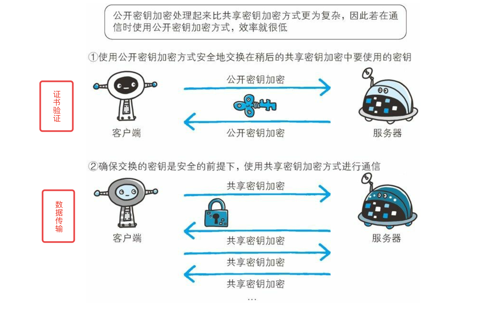

# HTTPS 握手过程

1.  服务端将自己的公钥登录至数字证书认证机构，数字证书认证机构用自己的私钥对服务端公钥署数字签名；
2.  客户端发出 HTTPS 请求，请求服务端建立 SSL / TLS 连接；
3.  服务端接收到 HTTPS 请求，将申请到的数字证书和服务端公钥一同返回给客户端；
4.  客户端在接收到服务端公钥后，数字证书认证机构利用提前植入到浏览器的认证公钥，向数字证书认证机构认证公钥证书上的数字签名，确认服务器公钥的真实性；
5.  认证通过之后，客户端随机生成通信使用的密钥，然后使用服务端公钥对密钥进行加密，返回给服务端；
6.  服务端收到加密内容后，通过服务端私钥进行非对称解密，得到客户端密钥，至此双方都获得了对称加密的密钥；
7.  之后，双方使用密钥进行对称加密通信。

